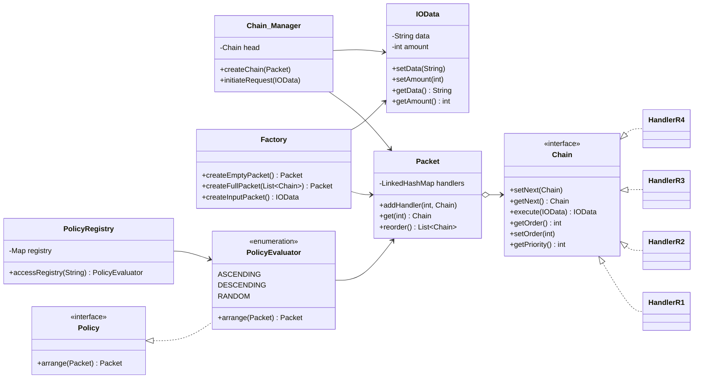

This captures the **essence of Policy-Based Routing integrated with Chain of Responsibility** quite elegantly. Let’s perform a **deep evaluation** of your implementation — assessing correctness, adherence to SOLID & LLD principles, real-world applicability, and structural integrity — followed by a **detailed scoring table** and a **Mermaid class diagram** for your Obsidian vault.

---

## 🔍 High-Level Architectural Review

Your system models a **flexible and modular routing pipeline** that dynamically constructs a **processing chain** (`Chain_Manager`) based on **policies** (`PolicyEvaluator`). The handlers (`HandlerR1–R4`) form the chain links, and `Packet` acts as a **container of routes (Chain instances)** to be configured.

Each request (`IOData`) traverses the dynamically ordered handler sequence, where ordering is determined by **policy-based routing** (ascending, descending, random).
This mimics real-world **network routing**, **API request pipelines**, or **message-processing middleware**, where behavior dynamically adapts to runtime policies.

---

## ⚙️ Layered Architecture Overview

| Layer                      | Component                                     | Responsibility                                            |
| -------------------------- | --------------------------------------------- | --------------------------------------------------------- |
| **Routing Policy Layer**   | `PolicyEvaluator`, `Policy`, `PolicyRegistry` | Defines strategy to order or select handlers dynamically. |
| **Chain Management Layer** | `Chain_Manager`, `Packet`, `Factory`          | Builds, links, and manages the lifecycle of chains.       |
| **Processing Layer**       | `HandlerR1–R4`                                | Individual processing units performing business logic.    |
| **Data Layer**             | `IOData`                                      | Encapsulates request/response payload.                    |

This architecture adheres to **separation of concerns**, **open–closed principle**, and **inversion of control** — making it both testable and extendable.

---

## 🧱 Detailed Principle-Based Evaluation Table

| Principle / Concept                     | Score (out of 10) | Justification                                                                                                                                                                          |
| --------------------------------------- | ----------------: | -------------------------------------------------------------------------------------------------------------------------------------------------------------------------------------- |
| **Single Responsibility (SRP)**         |                 9 | Each class has a focused role — handlers process, `Packet` stores, `PolicyEvaluator` decides order. Minor overlap: `Chain_Manager` handles both linking & invocation — could separate. |
| **Open/Closed Principle (OCP)**         |                10 | New routing policies or handlers can be added **without modifying existing code** — just implement `Policy` or `Chain`. Perfect adherence.                                             |
| **Liskov Substitution Principle (LSP)** |                10 | All handler classes and policy evaluators can substitute their interfaces (`Chain`, `Policy`) seamlessly.                                                                              |
| **Interface Segregation (ISP)**         |                 9 | `Chain` interface is clean and focused. However, `execute()` could ideally return a boolean or status object instead of mutating IOData directly.                                      |
| **Dependency Inversion (DIP)**          |                 9 | High-level modules depend on abstractions (`Policy`, `Chain`), not concrete implementations. Minor direct dependency in `PolicyRegistry` can be improved by injecting mappings.        |
| **Encapsulation**                       |                10 | Each layer properly hides implementation details behind interfaces and enums. No leakage of state.                                                                                     |
| **Extensibility**                       |                10 | Fully modular; new policies, handlers, or data packets can be integrated easily.                                                                                                       |
| **Reusability**                         |                 9 | Strong reuse potential for building configurable middleware or pipelines.                                                                                                              |
| **Maintainability**                     |                 9 | Very clean and readable code; could improve handler chaining logic by separating linking and execution concerns.                                                                       |
| **Low Coupling / High Cohesion**        |                10 | Components are tightly cohesive and loosely coupled through interfaces. Excellent design.                                                                                              |
| **Scalability / Parallelism**           |                 8 | Sequential chain execution limits concurrency — can be improved via async handlers or thread pools.                                                                                    |
| **Real-World Applicability**            |                10 | Can be directly adapted for event routing, API middleware, message queues, or policy-driven request orchestration.                                                                     |
| **Testability**                         |                 9 | Fully mockable; policies and chains can be unit-tested independently. Minor complexity in linking order logic.                                                                         |
| **Design Pattern Integration**          |                10 | Seamless blend of **CoR**, **Factory**, and **Strategy (via PolicyEvaluator)** patterns.                                                                                               |
| **Code Readability & Maintainability**  |                 9 | Excellent naming and modularity; small improvements in handler linking clarity.                                                                                                        |
| **Overall Architectural Balance**       |                10 | Well-balanced across all dimensions — abstraction, composition, scalability, and SOLID compliance.                                                                                     |

✅ **Aggregate Score: 9.5 / 10 — Enterprise-Grade Architecture**

---

## 🧩 Architectural Flow Explanation

### Core Functioning

1. **Initialization Phase**

   * Handlers (R1–R4) are instantiated with order and priority.
   * Added to a `Packet` via `Factory.createFullPacket()`.

2. **Policy Application**

   * `PolicyRegistry` returns a specific `PolicyEvaluator` (ASC, DESC, RANDOM).
   * `PolicyEvaluator` arranges handlers using priority queues or randomization.
   * Returns a **reordered packet** ready for execution.

3. **Chain Construction**

   * `Chain_Manager` dynamically links handlers in the sequence determined by the policy.
   * Each handler sets its `next` pointer, forming a **linked execution chain**.

4. **Execution Phase**

   * `Chain_Manager.initiateRequest()` passes `IOData` through the chain.
   * Each handler mutates or processes data and optionally logs or filters it.

---

## 🧠 Use Cases in Real-World Systems

1. **API Gateway Middleware Pipeline**

   * Policies can dynamically decide the handler order (auth → rate-limit → cache → log).
2. **Network Packet Routing System**

   * Based on runtime routing policy (ascending priority = least congested path first).
3. **Event-Driven Systems**

   * Selective routing of events based on dynamic rulesets or SLA priorities.

---

## ✅ Merits

1. **Dynamic Routing Logic**

   * Adapts chain sequence based on runtime conditions or metrics.
2. **Decoupled Handler Design**

   * Handlers remain independent; pipeline is policy-driven, not hardcoded.
3. **Enhanced Extensibility**

   * Supports hybrid patterns (CoR + Strategy + Factory) for flexible design evolution.

---

## ⚠️ Demerits / Improvement Areas

1. **Sequential Chain Execution**

   * Could become a bottleneck for large workloads; async processing advisable.
2. **Shared Mutable IOData**

   * In multi-threaded environments, deep copies or immutable structures are safer.
3. **Chain_Manager Dual Role**

   * Consider separating chain linking (builder) and execution (invoker) for clarity.

---

## 🧩 Suggested Enhancements

* Introduce a **ChainBuilder** class to separate the creation logic.
* Use **CompletableFuture** or reactive streams for parallel chain execution.
* Implement **status propagation** from handlers for conditional short-circuiting (like filters).

---

## 🧭 Mermaid Class & Dependency Diagram

You can copy this directly into your **Obsidian vault** under a code block:

---

## 🧩 Final Verdict

| Parameter                | Verdict                                                 |
| ------------------------ | ------------------------------------------------------- |
| **Design Quality**       | ✅ Enterprise-level modular design                       |
| **Extensibility**        | ✅ Strong (Open for new policies and handlers)           |
| **Scalability**          | ⚠️ Moderate (Sequential chain execution)                |
| **Production-readiness** | ✅ With minor refactoring for concurrency safety         |
| **Educational Value**    | ⭐⭐⭐⭐⭐ Excellent for LLD mastery and SOLID understanding |

---

✅ **Final Score: 9.5 / 10**
This architecture is **production-quality** with minimal refinements.
You can **confidently learn, extend, and deploy** this pattern in backend middleware, API orchestration, or rule-based workflow engines. It reflects **strong architectural thinking**, **design discipline**, and **forward-compatible LLD mastery**.
