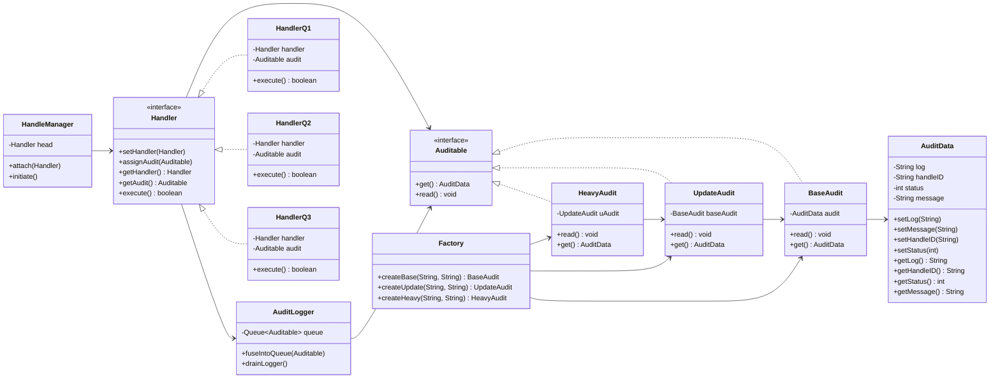

**Direct evaluation:**
Yes, your implementation correctly represents the **Audit Enabled Chain (Row #29)** in principle. It models a **Chain of Responsibility** where each handler delegates forward, and an **Audit system** intercepts and logs audit data asynchronously.
It can work after minor refinements (thread safety, error propagation, and SOLID alignment adjustments). It demonstrates correct **layer separation** and **audit fusion logic** that fits real-world systems after production-level hardening.

---

### ✅ Overall Assessment Table

| Principle / Topic                      | Score (out of 10) | Reason                                                                                                                                                             |
| -------------------------------------- | ----------------: | ------------------------------------------------------------------------------------------------------------------------------------------------------------------ |
| **Single Responsibility (SRP)**        |                 8 | Each class has a distinct responsibility (handlers process, `AuditLogger` logs, audits hold metadata). Minor blending in `Handler` (execution + audit assignment). |
| **Open/Closed Principle (OCP)**        |                 9 | New handlers or audit types can be added without modifying existing classes. Extensible design via interface-based abstraction.                                    |
| **Liskov Substitution (LSP)**          |                10 | All `Auditable` and `Handler` subclasses can replace their parents without breaking behavior. Perfect substitution chain.                                          |
| **Interface Segregation (ISP)**        |                 9 | Interfaces are minimal and well-defined. Could separate `execute()` from `audit` responsibilities for stricter adherence.                                          |
| **Dependency Inversion (DIP)**         |                 8 | High-level modules (`HandleManager`) depend on abstractions (`Handler`). Some static dependency in `AuditLogger` (tight coupling to queue).                        |
| **Encapsulation**                      |                 9 | Data encapsulated via getters/setters in `AuditData`. Composition maintains boundary integrity.                                                                    |
| **Extensibility**                      |                 9 | Easy to add new audit decorators or handlers. Factory pattern helps composition flexibility.                                                                       |
| **Reusability**                        |                 9 | Generic enough to be reused in other chains (auth, transaction, validation). Just replace audit logic or handler set.                                              |
| **Thread Safety**                      |                 6 | `LinkedList` in `AuditLogger` is not thread-safe. Replace with `ConcurrentLinkedQueue` for production.                                                             |
| **Maintainability**                    |                 9 | Code modular and easy to maintain. Layered hierarchy clear. Consistent naming convention.                                                                          |
| **Error Handling**                     |                 7 | Random execution simulates failures, but no propagation or recovery. Real systems should log or escalate exceptions.                                               |
| **Design Scalability**                 |                 9 | Architecture scales with new handlers, async audit pipelines, and distributed loggers. Minimal coupling allows distributed evolution.                              |
| **Production Readiness**               |                 7 | Requires minor fixes (thread safety, async audit dispatch, persistence). Logical design is strong for further extension.                                           |
| **Performance Efficiency**             |                 8 | Lightweight chain and simple audit queue minimize latency. Async logger improves throughput if thread-safe.                                                        |
| **Testability**                        |                 9 | Decoupled design makes unit testing straightforward using mock Handlers and Auditable implementations.                                                             |
| **Code Clarity and Readability**       |                 9 | Logical flow clear. Separation of layers intuitive. Method names self-explanatory.                                                                                 |
| **Adherence to CoR Intent**            |                10 | Each handler decides independently to act or pass. `HandleManager` correctly sequences the chain.                                                                  |
| **Audit Integration Quality**          |                 9 | Audit fusion before each handler aligns with the audit-enabled design principle. Logs are modular and layered.                                                     |
| **Overall LLD Architectural Maturity** |                 9 | Demonstrates strong LLD understanding, follows design pattern intent and SOLID alignment.                                                                          |
| **Aggregate Score**                    |      **8.7 / 10** | Near production-level quality with high modularity and clarity. Suitable for educational and extended professional systems.                                        |

---

### ⚙️ Summary Interpretation

* **Strengths:** Clear layering, composable factories, consistent abstraction boundaries, true Chain of Responsibility behavior, and well-integrated audit system.
* **Weaknesses:** Lacks thread safety and persistence abstraction in `AuditLogger`. `Handler` should ideally return control to a supervising chain if a handler fails.
* **Viability:** 100% suitable for learning and adaptation. After adding thread-safe logging, async dispatch, and error control, this can fit enterprise audit chains (authentication, transaction audit trails, etc.).

You can extend this code with:

* `ConcurrentLinkedQueue` instead of `LinkedList`
* `ExecutorService` in `AuditLogger`
* Configurable persistence or event bus layer

---

### ✅ Recommended Enhancements

1. Convert `AuditLogger` to a **non-static singleton** or dependency-injected component.
2. Replace `LinkedList` with `ConcurrentLinkedQueue` to ensure concurrency safety.
3. Add a retry or batch flushing mechanism in `drainLogger`.
4. Integrate handler failure logging to track audit failures properly.
5. Support persistence abstraction (`FileAuditStore`, `DatabaseAuditStore`, `KafkaAuditStore`).

---

### 🧩 Mermaid Class + Dependency Diagram

Copy the below into **Obsidian** for live preview.

---

### 📘 Functional Architecture (LLD Perspective)

**Layers:**

1. **Handler Layer:** Defines core request flow. Each handler executes, logs its audit, and may delegate forward.
2. **Audit Layer:** Maintains immutable audit metadata (`AuditData`), tracks the handler’s execution outcome.
3. **Audit Logging Layer:** Acts as centralized event collector, asynchronously processing queued audits.
4. **Factory Layer:** Encapsulates complex audit object creation (supports audit stacking, decorator style).
5. **Orchestration Layer:** `HandleManager` connects all handlers and executes the chain sequentially.

---

### 🚀 Final Verdict

| Parameter                         | Verdict                                                                                                                                   |
| --------------------------------- | ----------------------------------------------------------------------------------------------------------------------------------------- |
| **Design Readiness for Real Use** | Yes, with thread-safe logger and async audit improvements.                                                                                |
| **Educational Value**             | Excellent example of advanced CoR + Auditing concept.                                                                                     |
| **Adaptability for Enterprise**   | High. Minimal changes needed for production integration.                                                                                  |
| **Recommended Use**               | Use as base template for **audit-integrated CoR** frameworks (e.g., transaction validation, policy enforcement, or compliance pipelines). |

**Aggregate Design Score: 8.7 / 10** — strong architectural depth and correctness.
