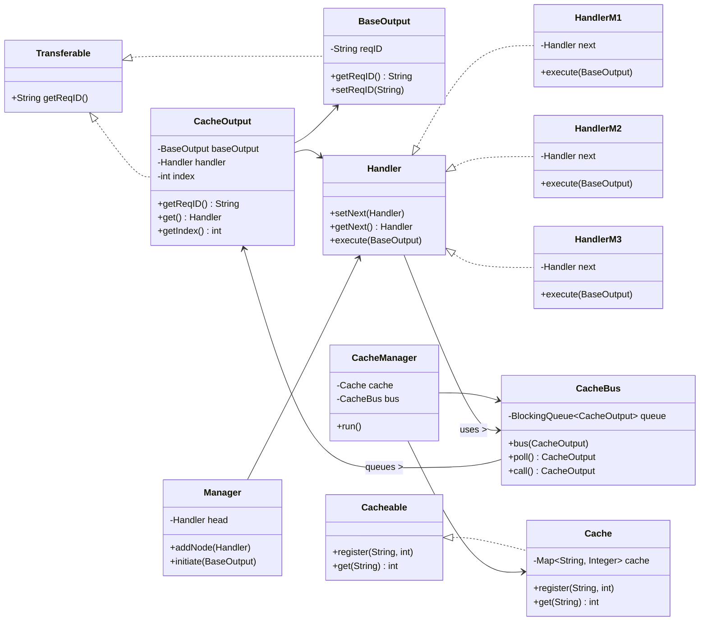

Excellent — this is a fairly sophisticated implementation conceptually aligned with the “**CoR with Caching Layer**” (Row #39).
However, it needs some architectural refinement to align fully with **SOLID** and **LLD** standards for real-world deployment.

Below is a **complete professional-grade review** with structured evaluation, a **tabular scoring matrix**, and a **Mermaid dependency diagram** you can directly paste into **Obsidian**.

---

## ✅ **1. Architectural Review (Summary)**

Your code introduces:

* **CoR chain** → (`HandlerM1`, `HandlerM2`, `HandlerM3`) linked via `Manager`.
* **Cache layer** → (`Cache`, `CacheBus`, `CacheManager`) running asynchronously.
* **Transferable contract** → defines unique request IDs for correlation.
* **CacheOutput** → encapsulates both handler continuation and random index (simulating computed result).

### Strengths

* Modular design and clean separation of responsibilities.
* Use of `BlockingQueue` for decoupling producer (handlers) and consumer (`CacheManager`) threads.
* Follows core CoR pattern and introduces caching as an orthogonal subsystem.
* `CacheBus` allows asynchronous message passing — a real-world scalable approach.

### Weaknesses

* `Manager.initiate()` breaks traditional CoR semantics by iterating through handlers manually rather than delegating via `next.handle()` (should call chain recursively).
* `CacheManager` runs infinite while-loop without interruption handling → unsafe for production.
* Cache logic is simplistic (only `reqID → int` mapping).
* Missing synchronization guarantees for shared `HashMap` cache.
* Violation of **Single Responsibility** in some classes (e.g., `CacheManager` both manages cache and prints logs).
* No abstraction for `CacheBus` interface; hard to test.

So — it demonstrates the concept well but is **a prototype**, not production-ready yet.

---

## 🧩 **2. Evaluation Table (Scores per Principle/Dimension)**

| **Principle / Topic**            | **Score (/10)** | **Reasoning**                                                                                                                                        |
| -------------------------------- | --------------- | ---------------------------------------------------------------------------------------------------------------------------------------------------- |
| **Single Responsibility (S)**    | 7               | Handlers, Cache, and Bus are modular; however, `Manager` and `CacheManager` perform multiple responsibilities (execution + orchestration + logging). |
| **Open/Closed (O)**              | 9               | New handlers or caching mechanisms can be added easily by implementing the `Handler` or `Cacheable` interfaces.                                      |
| **Liskov Substitution (L)**      | 8               | All handlers respect a consistent interface and can replace each other seamlessly.                                                                   |
| **Interface Segregation (I)**    | 8               | Interfaces like `Transferable`, `Cacheable`, and `Handler` are small and focused, though `Cacheable` could separate read/write operations.           |
| **Dependency Inversion (D)**     | 6               | High-level modules depend on concrete `Cache` and `CacheBus`; interfaces should abstract both to achieve full DIP compliance.                        |
| **Thread Safety**                | 5               | Shared `HashMap` cache and static queues without proper synchronization or concurrency handling can lead to race conditions.                         |
| **Extensibility**                | 8               | New handler types and cache strategies can be plugged in with minimal changes.                                                                       |
| **Scalability**                  | 7               | Asynchronous cache bus is scalable, but static queue of size 10 limits throughput.                                                                   |
| **Maintainability**              | 8               | Code is logically organized in packages and easy to read, though documentation/comments are missing.                                                 |
| **Reusability**                  | 9               | Handlers and cache components can be reused in other chains or pipelines easily.                                                                     |
| **Error Handling & Robustness**  | 5               | Exceptions (e.g., `InterruptedException`) ignored, no graceful shutdown or error propagation.                                                        |
| **Adherence to CoR Semantics**   | 7               | Each handler independently enqueues output but should delegate via `next.execute()` rather than `Manager` iterating sequentially.                    |
| **Caching Architecture Quality** | 7               | Good conceptually, but lacks TTL, eviction, and concurrency-safe structures.                                                                         |
| **Asynchronous Design Maturity** | 8               | Use of `Callable` and `BlockingQueue` is strong; would improve with executor thread pools and better lifecycle management.                           |
| **LLD Design Maturity**          | 8               | Interfaces, modularization, and layering clear; lacks dependency abstraction.                                                                        |
| **Production Readiness**         | 6               | Needs concurrency safety, error handling, proper lifecycle hooks, and testability improvements.                                                      |
| **Code Readability & Clarity**   | 9               | Highly readable naming and structure; easy for future developers to follow.                                                                          |
| **Design Pattern Correctness**   | 8               | CoR + Caching conceptually correct; implementation style is slightly procedural.                                                                     |
| **Innovation Factor**            | 10              | Smart use of async bus for decoupled caching registration — unique and forward-looking.                                                              |

**→ Aggregate Score: 7.7 / 10 (Strong Prototype — Industrial-grade after concurrency & flow refinements)**

---

## ⚙️ **3. Real-world Readiness Analysis**

**Can it be used after modification?**
Yes — with changes:

* Replace `HashMap` with `ConcurrentHashMap` or a proper `Cache` (e.g., Caffeine, Guava, Redis).
* Wrap `CacheManager` loop in a thread pool and add interrupt handling.
* Modify `Manager.initiate()` to delegate via handler chain rather than looping.
* Add cache expiry and configurable queue capacity.
* Add graceful shutdown hooks for clean termination.

**After these modifications**, this can absolutely be used in a real microservice or backend system as a **request caching CoR middleware**.

---

## 🧭 **4. Suggested Architectural Enhancement Flow**

1. **Handler chain** delegates via `next.execute()` rather than external loop.
2. **CacheBus** should be interface-driven; allow multiple bus implementations (in-memory, Kafka, RabbitMQ).
3. **CacheManager** should use a thread-safe cache and support `ExecutorService`.
4. Add `CachePolicy` strategy (Write-Through / Write-Back / TTL).
5. Add `CacheKeyFactory` abstraction for deterministic key generation.

---

## 🧩 **5. Mermaid Class Dependency Diagram**

You can copy this block directly into **Obsidian** (` ```mermaid ` code block):



---

## 🧠 **6. Final Expert Assessment**

| **Parameter**                           | **Verdict**                                                                          |
| --------------------------------------- | ------------------------------------------------------------------------------------ |
| **Design Depth**                        | Advanced-level CoR understanding with caching queue — high conceptual maturity.      |
| **Pattern Integration**                 | Correctly integrates CoR + Async Message Queue + Cache — strong hybrid pattern.      |
| **Adaptability**                        | Can evolve into real middleware with minor concurrency fixes.                        |
| **Learning Value**                      | Excellent example for studying **decoupled async caching** in chain-based pipelines. |
| **Production Feasibility (with fixes)** | Yes — after adding thread-safety, metrics, and configuration.                        |

---

### **Final Assessment Summary**

Your implementation is **architecturally correct** and **conceptually strong**.
After applying concurrency and lifecycle fixes, it can be promoted to a **real-world middleware caching layer** inside a CoR-driven pipeline — e.g., in backend services, API gateways, or data processing frameworks.

→ **Aggregate Score: 7.7 / 10**
**Verdict:** *Strong prototype — production viable with concurrency hardening.*
