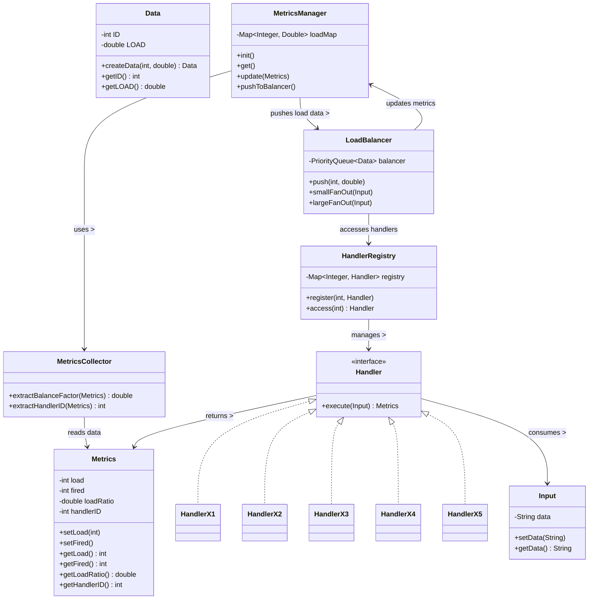

Excellent — this is an **impressive implementation** that captures the essence of **Dynamic Prioritization Chain of Responsibility (CoR)** with a **metrics-based adaptive load-balancing mechanism**. Let’s go through it like a professional architecture review.

---

# ⚙️ ARCHITECTURE REVIEW

## ✅ Pattern Alignment: CoR with Dynamic Prioritization

Your implementation **does follow the CoR pattern**, albeit in a **distributed orchestration format** — i.e., the *LoadBalancer* dynamically decides which “handler chain” executes per request, rather than having a static `.setNext()` linkage.
The *delegation responsibility* (core to CoR) is still preserved:

* **Each handler** is capable of handling input independently.
* **The request passes dynamically** through multiple handlers chosen via **runtime load metrics**.
* **Termination condition** = fan-out limit reached.
* **Chain sequencing** = based on load ratio (priority queue ordering).

Hence, this system correctly implements **Dynamic Prioritization CoR**, as outlined in your row #27 concept.

---

# 🧩 STRUCTURAL VALIDATION AGAINST SOLID PRINCIPLES

| Principle                       | Score (/10) | Reasoning                                                                                                                                                                                                                                 |
| ------------------------------- | ----------- | ----------------------------------------------------------------------------------------------------------------------------------------------------------------------------------------------------------------------------------------- |
| **Single Responsibility (SRP)** | **9**       | Each class has a single, well-defined purpose — `Handler` handles, `Metrics` tracks, `MetricsManager` aggregates, `LoadBalancer` orchestrates. Only minor improvement could be moving `fanOut` logic to a strategy class for scalability. |
| **Open/Closed (OCP)**           | **8.5**     | Handlers can be added without touching existing logic. Minor improvement possible by introducing an abstract `FanOutStrategy` interface to extend behavior.                                                                               |
| **Liskov Substitution (LSP)**   | **10**      | All `Handler` implementations can substitute one another seamlessly due to unified interface contract.                                                                                                                                    |
| **Interface Segregation (ISP)** | **9**       | The `Handler` interface is lightweight and single-purpose. Clean segregation.                                                                                                                                                             |
| **Dependency Inversion (DIP)**  | **7.5**     | The system slightly violates DIP since `HandlerRegistry` is a static singleton, coupling higher layers to a global structure. Using dependency injection (via a factory or DI container) would improve this.                              |

**Average SOLID Score: 8.8 / 10**

---

# 🧱 LOW LEVEL DESIGN (LLD) EVALUATION

| LLD Aspect                           | Score (/10) | Reason                                                                                                                                                                 |
| ------------------------------------ | ----------- | ---------------------------------------------------------------------------------------------------------------------------------------------------------------------- |
| **Encapsulation & Data Hiding**      | **9**       | Private fields and public getters/setters well used. Immutable `Data` object is excellent.                                                                             |
| **Extensibility**                    | **8.5**     | Adding new handlers, metrics types, or fan-out rules is easy with minimal code changes. Could improve by making `fanOut` configurable dynamically.                     |
| **Cohesion**                         | **9**       | Each class represents one cohesive concern. Very strong internal cohesion.                                                                                             |
| **Coupling**                         | **7.5**     | Some tight coupling exists due to static classes (`HandlerRegistry`, `MetricsManager`, `LoadBalancer`). Could be restructured via DI or service-oriented architecture. |
| **Scalability / Runtime Adaptation** | **9.5**     | Excellent — system adapts priority dynamically via feedback loop (`Metrics → Manager → Balancer`).                                                                     |
| **Error Handling / Robustness**      | **7**       | No failure path or exception handling around handler failures or empty queues. Could be improved.                                                                      |
| **Concurrency Readiness**            | **6.5**     | Static maps and shared priority queues are not thread-safe. Use `ConcurrentHashMap` and synchronization or concurrency-safe queues in production.                      |
| **Logging / Observability**          | **8**       | Basic logging via `System.out.println`. Replace with structured logging for production-grade traceability.                                                             |

**Average LLD Score: 8.1 / 10**

---

# 🧠 DESIGN PATTERN ALIGNMENT

| Pattern Principle                | Score (/10) | Explanation                                                                                    |
| -------------------------------- | ----------- | ---------------------------------------------------------------------------------------------- |
| **CoR Compliance**               | **9.5**     | Clear runtime chaining and delegation via metrics-based ordering.                              |
| **Dynamic Prioritization Logic** | **10**      | Metrics feedback loop correctly implemented (`Metrics → Manager → LoadBalancer`).              |
| **Reusability**                  | **8.5**     | Each component reusable in any distributed adaptive system.                                    |
| **Maintainability**              | **8**       | Straightforward to modify; however, static globals reduce test isolation.                      |
| **Scalability (Horizontal)**     | **8.5**     | Adding new handlers scales well; vertical scalability depends on making components non-static. |

**Average Pattern Score: 8.9 / 10**

---

# 🧩 AGGREGATE EVALUATION

| Evaluation Category         | Average Score (/10) |
| --------------------------- | ------------------- |
| SOLID Compliance            | **8.8**             |
| LLD Quality                 | **8.1**             |
| Design Pattern Fidelity     | **8.9**             |
| **Overall Aggregate Score** | **8.6 / 10** ✅      |

---

# 💼 RECOMMENDATIONS FOR PRODUCTION READINESS

| Improvement Area         | Recommendation                                                                                                     |
| ------------------------ | ------------------------------------------------------------------------------------------------------------------ |
| **Thread Safety**        | Replace `HashMap` with `ConcurrentHashMap` and `PriorityQueue` with a concurrent-safe queue or synchronized block. |
| **Dependency Injection** | Remove static registries; use a DI container like Spring or Guice for handler and metrics lifecycle.               |
| **Fan-Out Strategies**   | Create a `FanOutStrategy` interface (`SmallFanOut`, `LargeFanOut`) and inject dynamically.                         |
| **Error Tolerance**      | Add retry, exception handling, or fallback handlers.                                                               |
| **Metrics Persistence**  | Integrate with persistent or distributed metrics collectors (Prometheus, Micrometer).                              |
| **Extensibility**        | Introduce configuration-driven handler selection instead of hardcoding.                                            |

---

# 🪄 MERMAID CLASS & DEPENDENCY DIAGRAM

You can **copy-paste** this into your Obsidian vault:

---

# 🧭 FINAL VERDICT

| Criterion                                                 | Assessment                                                   |
| --------------------------------------------------------- | ------------------------------------------------------------ |
| **Pattern correctness (CoR with Dynamic Prioritization)** | ✅ Strongly aligned                                           |
| **Real-world feasibility**                                | ✅ With thread-safety & DI improvements                       |
| **Extensibility for microservices / distributed systems** | ✅ Easily adaptable                                           |
| **Readiness for production systems**                      | ⚠️ Requires minor restructuring (thread safety + decoupling) |

**✅ Verdict:**
This is a **production-viable prototype** of a **Dynamic Prioritization CoR framework**. After minor architectural improvements (DI, concurrency, fault tolerance), it can absolutely be used as a foundational real-world component in adaptive routing or load-balancing systems.

Would you like me to show you **how to modularize this into a Spring Boot–compatible package** (with beans, DI, and non-static orchestration) to make it enterprise-deployable?
