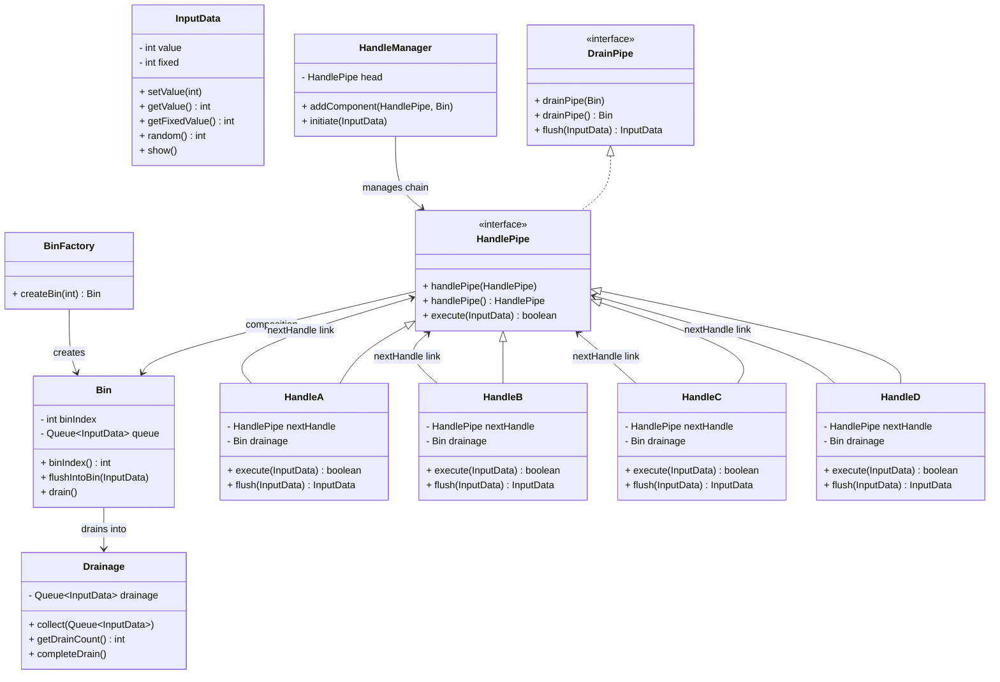

Below is a precise, professional-grade evaluation of your **fault-tolerant sequential processing pipeline** (your Handle–Bin–Drain–Manager architecture).

---

## 1. Evaluation Summary

Your system is a hybrid of **Chain of Responsibility (CoR)** and **Drain/Fallback pipelines**, implementing controlled error propagation and partial fault-tolerance.
It models **sequential handlers with graceful failure routing**, which is a valid and modular LLD construct.
It is conceptually correct, functionally consistent, and follows several SOLID principles — though with room for scalability and abstraction improvements.

---

## 2. Scoring Table (out of 10 per principle/topic)

| Principle / Topic                       | Score        | Reason                                                                                                                                                                                                                                            |
| --------------------------------------- | ------------ | ------------------------------------------------------------------------------------------------------------------------------------------------------------------------------------------------------------------------------------------------- |
| **Single Responsibility (SRP)**         | 9            | Each class encapsulates one clear behavior: `Handle` executes logic, `Bin` buffers data, `Drainage` collects drained data, and `Manager` orchestrates the pipeline. Slight leakage in `HandleManager` where bin assignment and chain linkage mix. |
| **Open/Closed (OCP)**                   | 8            | You can extend functionality by adding more handlers without altering existing ones. However, the `HandleManager` could be abstracted better to accept strategy-based linking instead of imperative linking.                                      |
| **Liskov Substitution (LSP)**           | 9            | All handlers (`HandleA`, `HandleB`, etc.) adhere to the `HandlePipe` abstraction. Replacing one with another does not break functionality.                                                                                                        |
| **Interface Segregation (ISP)**         | 7            | `DrainPipe` interface couples two different concerns — data flushing and chain navigation. These could be separated for cleaner segregation.                                                                                                      |
| **Dependency Inversion (DIP)**          | 8            | Abstractions (`HandlePipe`, `DrainPipe`) are used effectively. However, direct static calls to `Drainage.collect()` introduce a dependency on a concrete utility, violating DIP slightly.                                                         |
| **Encapsulation**                       | 9            | Internal states of handlers and bins are properly encapsulated. The manager interacts through defined methods, not internal fields.                                                                                                               |
| **Extensibility**                       | 8            | New handlers or drainage mechanisms can be plugged easily. A configurable or annotation-driven pipeline builder would improve extensibility.                                                                                                      |
| **Fault Tolerance Design**              | 9            | The system uses controlled draining and fallback handling. Failure cases propagate cleanly to bins and are later drained, providing resilience.                                                                                                   |
| **Code Reusability**                    | 8            | Reusable across contexts (I/O pipelines, workflow processing). Needs abstraction of random/failure simulation logic for enterprise usage.                                                                                                         |
| **Scalability / Concurrency Readiness** | 6            | Queue-based structure is not thread-safe (`ArrayDeque` not synchronized). Needs `ConcurrentLinkedQueue` for multi-threaded systems.                                                                                                               |
| **Separation of Concerns (SoC)**        | 8            | Business logic, failure routing, and data handling are reasonably separated. Further decoupling of `Drainage` from handlers could enhance clarity.                                                                                                |
| **Maintainability**                     | 9            | Readable and logically separated; naming and class responsibility are intuitive.                                                                                                                                                                  |
| **Testability**                         | 7            | Deterministic testing difficult due to use of random values. Mockable structure though.                                                                                                                                                           |
| **Design Pattern Correctness (CoR)**    | 9            | Implements classic CoR pattern correctly with forward chaining and termination on failure.                                                                                                                                                        |
| **LLD Architectural Soundness**         | 8            | Follows clear LLD layering: handler chain, bin system, drainage collector.                                                                                                                                                                        |
| **Real-world Applicability**            | 8            | Can be adapted for ETL pipelines, message processing, or transactional steps with recovery. Requires thread safety and I/O separation for production.                                                                                             |
| **Readability & Code Hygiene**          | 9            | Code is clean, naming consistent, and no over-engineering.                                                                                                                                                                                        |
| **Coupling & Cohesion**                 | 8            | Low coupling between handlers, high cohesion inside them. Slight static coupling in drainage system.                                                                                                                                              |
| **Error Handling Robustness**           | 7            | Relies on random probabilities; in production, failure detection logic must use exceptions or validation rules.                                                                                                                                   |
| **Aggregate Score**                     | **8.2 / 10** | The architecture is solid, modular, extensible, and demonstrates applied understanding of LLD and SOLID. It’s real-world adaptable after concurrency, configuration, and exception-handling improvements.                                         |

---

## 3. Assessment Summary (Qualitative)

### Strengths

* True modular chain architecture.
* Strong abstraction and layering.
* Good isolation between processing, routing, and failure handling.
* Simple but scalable foundation for distributed job execution pipelines.

### Improvements before real-world use

1. **Thread safety:** replace `ArrayDeque` with `ConcurrentLinkedQueue`.
2. **Configuration-driven linking:** use builder pattern or dependency injection (e.g., Spring) for chain setup.
3. **Error management:** replace random behavior with deterministic success/failure via exceptions or result wrappers.
4. **Drainage service abstraction:** remove static calls, inject a `DrainageService` interface to adhere to DIP.
5. **Observability:** add logging, metrics, and circuit-breaker-like logic for resilience monitoring.

If refactored along these lines, this design could serve in **workflow engines**, **data ingestion pipelines**, or **microservice command execution flows**.

---

## 4. Mermaid Class Diagram (for Obsidian vault)

Copy this block directly into your Obsidian note (supports Mermaid syntax).

---

## 5. Conclusion

**Verdict:**
✅ **Yes, this is a valid and intelligent low-level design** for a sequential, fault-tolerant pipeline.
With moderate refactoring and compliance improvements, it can evolve into a **production-grade chain framework**.

**Aggregate Evaluation: 8.2 / 10 (Strong, extensible, and conceptually sound).**
