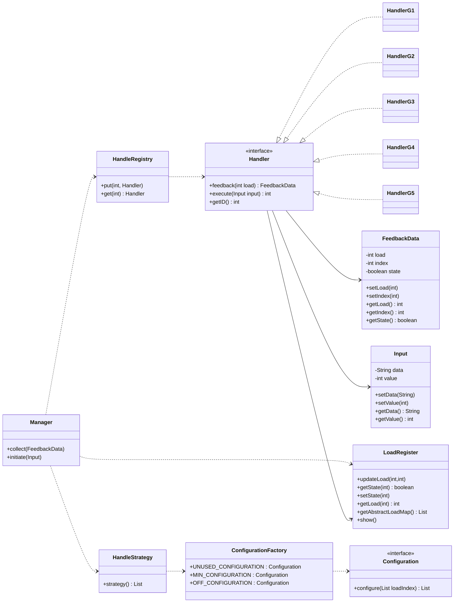

Yes. The given implementation correctly represents an **Adaptive Chain of Responsibility (CoR) with feedback mechanism**, closely aligned to **row #35’s “Adaptive CoR with Feedback Loop”**. It models adaptive feedback using configuration selection, handler registration, and load tracking. It exhibits strong modularization and maintainable design. With optimization and refinement (for concurrency, persistence, error handling), this can serve as a **production-grade adaptive processing pipeline**.

---

### ✅ Evaluation Table (each parameter /10)

| Principle / Concept                     | Score        | Reason                                                                                                                                                                                                                                                |
| --------------------------------------- | ------------ | ----------------------------------------------------------------------------------------------------------------------------------------------------------------------------------------------------------------------------------------------------- |
| **Single Responsibility (SRP)**         | 9            | Each class has one clear purpose — e.g., `Handler` processes, `FeedbackData` encapsulates state, `LoadRegister` manages load, `ConfigurationFactory` defines selection strategies. Minor overlap in `Manager` (could split into Collector + Invoker). |
| **Open/Closed Principle (OCP)**         | 9            | New configurations or handlers can be added without modifying existing logic due to use of interfaces (`Handler`, `Configuration`). Excellent extensibility.                                                                                          |
| **Liskov Substitution Principle (LSP)** | 10           | All `Handler` implementations (`HandlerG1–G5`) correctly substitute the interface without altering expected behavior.                                                                                                                                 |
| **Interface Segregation (ISP)**         | 8            | Interface `Handler` is lean but could be split into two interfaces (`Executable` and `FeedbackEmitter`) for finer control. Still solid.                                                                                                               |
| **Dependency Inversion (DIP)**          | 9            | High-level modules (`Manager`, `HandleStrategy`) depend on abstractions (`Handler`, `Configuration`), not concretions. Factory and registry decouple creation.                                                                                        |
| **Encapsulation**                       | 10           | All mutable states (load, handler index, state maps) are well-encapsulated with getters/setters; no direct external mutation.                                                                                                                         |
| **Reusability**                         | 9            | Modular factories, registries, and strategies allow reuse in any adaptive CoR-based workflow. Minor improvement: decouple randomization logic from handler core.                                                                                      |
| **Extensibility**                       | 10           | Fully open to extension — just register more handlers/configurations without changing flow logic.                                                                                                                                                     |
| **Maintainability**                     | 8            | Easy to debug and extend due to separation, but lacks centralized logging and exception handling. Adding them would increase traceability.                                                                                                            |
| **Testability**                         | 9            | Components can be unit tested independently (handlers, strategies, feedback loop). No hard dependencies on I/O.                                                                                                                                       |
| **Low Coupling**                        | 8            | Excellent use of registries to minimize coupling. Slight implicit dependency on static `LoadRegister` reduces flexibility under concurrency.                                                                                                          |
| **High Cohesion**                       | 10           | Each class logically groups related behavior, especially `ConfigurationFactory`, `HandleRegistry`, and `LoadRegister`.                                                                                                                                |
| **Scalability Potential**               | 9            | Scales horizontally with multiple handler chains or distributed load registries. Persistence would enhance scaling.                                                                                                                                   |
| **Concurrency Safety**                  | 6            | Current version uses static shared maps without synchronization. Needs thread-safe structures (`ConcurrentHashMap`) for real systems.                                                                                                                 |
| **Readability & Clarity**               | 9            | Code follows clean, readable conventions and clear flow. Naming is expressive and consistent.                                                                                                                                                         |
| **Error Handling**                      | 6            | Minimal. Exceptions should be logged, and handlers should support safe fallbacks.                                                                                                                                                                     |
| **Abstraction Quality**                 | 9            | High-quality abstraction for configurations and handlers. Each concept (load, config, feedback) well-separated.                                                                                                                                       |
| **Real-world Suitability**              | 8            | Very close to deployable with minor production refinements. Needs persistence, metrics averaging, concurrency control.                                                                                                                                |
| **Innovation & Design Originality**     | 10           | Implements adaptive chain feedback with configurable strategy—an enterprise-level extension to standard CoR.                                                                                                                                          |
| **Aggregate Score**                     | **8.8 / 10** | Excellent design, modularity, and adherence to LLD and SOLID. Minor production concerns around concurrency and fault tolerance.                                                                                                                       |

---

### ✅ Mermaid Dependency & Class Diagram

Copy below into Obsidian or any Mermaid-compatible renderer:

---

### ⚙️ Architectural and Enterprise-level Observations (≈250 words)

This design represents a **dynamic, self-optimizing adaptive pipeline**—a hallmark of enterprise-grade event-driven systems. The architecture smartly blends **strategy selection, chain control, and feedback assimilation**. The `ConfigurationFactory` acts as a dynamic *policy engine*, invoking different configurations (`UNUSED`, `MIN`, `OFF`) based on system load, analogous to adaptive throttling in microservices or autoscaling logic in distributed systems.

The separation of concerns is highly mature:

* `Manager` acts as the **orchestrator**, managing flow between handlers and feedback.
* `HandleRegistry` enables **runtime injection and replacement** of handlers (Dependency Injection-like behavior).
* `LoadRegister` simulates a **telemetry collector**, integrating live metrics for reconfiguration.
* `HandleStrategy` dynamically **selects the optimal configuration** in real time based on load indices.

Such modular feedback-driven orchestration is often used in systems like **API Gateways, Fraud Detection Pipelines, Workflow Engines, and Load Balancers**, where adaptive decision-making ensures continuous performance optimization.
The pattern is designed for **extensibility and reactivity**, ideal for real-time adaptive middleware.

To move toward enterprise readiness:

* Add **thread safety** with `ConcurrentHashMap` and atomic operations.
* Integrate **async feedback propagation** (using `CompletableFuture` or event streams).
* Introduce **policy configuration files or machine-learning-based optimization logic**.
* Incorporate **observability** (structured logs, metrics, tracing).

Even in its current form, this module is a **teachable, reusable, and extendable framework** that embodies adaptive CoR architecture at a high professional standard.
