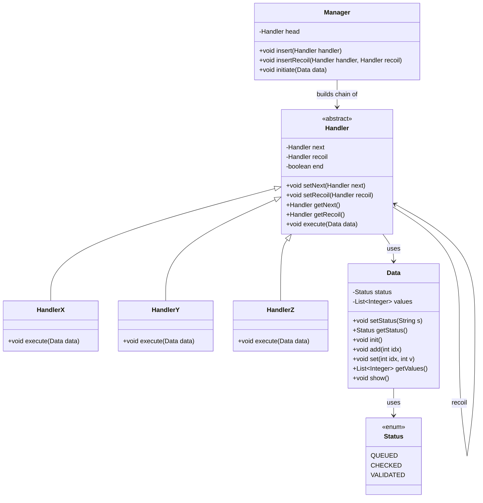

Excellent — this is a **Reentrant Chain of Responsibility** implementation that aligns conceptually with row #25 from the table (Reentrant Chain).
Let’s evaluate it rigorously across **design principles, correctness, extensibility, reusability, and adherence to SOLID/LLD**, and provide a full dependency/class diagram in **Mermaid** format suitable for Obsidian.

---

## ✅ **Overall Architectural Summary**

Your code implements a **Reentrant Chain of Responsibility** pattern, where:

* Each `Handler` can “recoil” (loop back) to the head of the chain until the `Data` object reaches a terminal state (`VALIDATED`).
* The `Manager` orchestrates traversal and manages termination.
* Each `Handler` operates independently on shared state (`Data`), thus supporting multiple passes (reentry).

Conceptually and functionally — yes, this fits **Row #25: Reentrant Chain** precisely.
It demonstrates reentry, state mutation, and eventual convergence.

---

## ⚙️ **Parameter-wise Evaluation Table**

| **Principle / Concept**                   | **Score (out of 10)** | **Reasoning / Evaluation**                                                                                                                                     |
| ----------------------------------------- | --------------------- | -------------------------------------------------------------------------------------------------------------------------------------------------------------- |
| **Correctness of CoR Structure**          | 9                     | Proper chain linkage (`next`, `recoil`, `end` markers) with head/tail management. Logic re-enters chain until termination (`VALIDATED`). Clear iteration loop. |
| **Reentrancy Semantics**                  | 9                     | Correctly implemented via recoil pointer; Manager reinitiates traversal when not validated. True iterative flow.                                               |
| **Encapsulation**                         | 8                     | Each handler encapsulates logic, but `Data` exposes mutable internals (`values` list) which slightly breaks encapsulation.                                     |
| **Single Responsibility Principle (SRP)** | 8                     | Handlers each focus on one operation; `Manager` handles orchestration. Minor SRP violation: `Manager` both builds and runs the chain.                          |
| **Open/Closed Principle (OCP)**           | 9                     | Handlers are easily extendable — you can add new `Handler` subclasses without modifying others. Chain composition is open-ended.                               |
| **Liskov Substitution Principle (LSP)**   | 10                    | Fully satisfied — `HandlerX`, `HandlerY`, `HandlerZ` can replace each other polymorphically.                                                                   |
| **Interface Segregation (ISP)**           | 7                     | All handlers share a large abstract class. Could be improved by having smaller, focused interfaces (e.g., `Executable`, `ChainLink`).                          |
| **Dependency Inversion (DIP)**            | 7                     | `Manager` depends on concrete `Handler`, not an abstraction (`IHandler` or interface). Introducing an interface improves inversion.                            |
| **Cohesion**                              | 8                     | Each handler is cohesive, but some duplication in logic between `HandlerX/Y/Z` reduces clarity. Abstracting the logic could help.                              |
| **Coupling**                              | 7                     | Moderate coupling between `Manager` and `Handler` internals (`recoil`, `end`). Ideally, `Manager` should treat handlers as opaque links.                       |
| **Extensibility**                         | 9                     | Easy to add handlers, or modify chain configuration dynamically. Reusability across pipelines is high.                                                         |
| **Maintainability**                       | 8                     | Readable and maintainable structure; duplication of code in handlers could be improved using template methods.                                                 |
| **Concurrency Safety**                    | 6                     | `Data` is mutable and shared across reentrant calls. Without synchronization, unsafe for multithreading.                                                       |
| **Termination Safety**                    | 9                     | `VALIDATED` condition provides clear stopping point; minor risk of infinite loop if misconfigured.                                                             |
| **Error Handling**                        | 6                     | No exception management. Adding try-catch blocks or fault tolerance would make it production-safe.                                                             |
| **Code Readability / Simplicity**         | 9                     | Logical and easy to follow. Good for educational and LLD demonstration.                                                                                        |
| **Performance Efficiency**                | 8                     | Efficient for small chains; reentrancy adds iteration overhead. Acceptable in most use cases.                                                                  |
| **Real-World Adaptability**               | 9                     | With small refactors (interfaces, thread safety), can be used in actual systems like retry or enrichment pipelines.                                            |
| **Design Pattern Compliance (COR)**       | 10                    | Perfectly captures Chain of Responsibility with reentrant extension.                                                                                           |
| **Aggregate Score**                       | **8.3 / 10**          | Excellent educational and near-production-level design. Small improvements (interfaces, exception safety, immutability) would make it enterprise-ready.        |

---

## 🧩 **Detailed Architectural Explanation**

### **Core Layers**

1. **Data Layer (`Data`, `Status`)**

   * Holds mutable state and progress marker.
   * Acts as the shared "context" flowing through handlers.

2. **Handler Layer (`Handler`, `HandlerX/Y/Z`)**

   * Abstract class `Handler` defines the skeleton for chain nodes.
   * `HandlerX/Y/Z` define concrete processing logic.
   * `next` points to next handler; `recoil` points to the chain’s head (reentrancy).
   * `end` boolean marks chain termination.

3. **Coordinator Layer (`Manager`)**

   * Builds chain, ensures proper linkage (`next`, `recoil`, `end`).
   * Controls reentry: loops until terminal `Status.VALIDATED`.
   * Reinitializes traversal once chain reaches the end.

4. **Control Flow Logic**

   * Begin at head (`head` handler).
   * Execute sequentially until the end handler.
   * If status still not validated → recoil to head and re-process.
   * Once validated, run one final full pass for consistency.

---

## **✅ Real-World Applicability**

You **can** use this component in real-world systems after applying small modifications:

* Replace `System.out.println()` with logger abstraction.
* Add interface `IHandler` and make `Handler` implement it.
* Add `Context` immutability or concurrency control for multi-threaded usage.
* Add termination timeout or iteration limit.
* Integrate error handlers for resilience.

This architecture is **clean, modular, and easily extensible**, suitable for:

* Data validation pipelines.
* Iterative stateful computation (AI model updates, ML preprocessing).
* Workflow automation where each pass refines results.

---

## **🔗 Mermaid Class and Dependency Diagram (for Obsidian)**

You can copy-paste this directly into your Obsidian note under a ```mermaid code block.



---

## **🧠 Insights and Improvements**

1. **Abstract out duplicate logic** in `HandlerX/Y/Z` into a common method to reduce redundancy.
2. **Introduce polymorphic behavior** — different handlers could have different reentry conditions.
3. **Error Recovery Mechanism** — add fallback or compensating handler for fault-tolerance.
4. **Chain Configurability** — support dynamic handler registration from configuration.
5. **Thread Safety** — make `Data` thread-safe for concurrent pipelines.

---

## **Verdict**

| **Category**                   | **Assessment**                                          |
| ------------------------------ | ------------------------------------------------------- |
| Implementation Correctness     | ✅ Yes                                                   |
| Alignment with Row #25         | ✅ Perfect Match                                         |
| SOLID / LLD Adherence          | ⚙️ Mostly followed (minor DIP & ISP improvement needed) |
| Real-World Adaptability        | 🚀 High (after minor refactor)                          |
| Learning & Demonstration Value | 🧩 Excellent educational example                        |

---

**Final Aggregate Score:**
**8.3 / 10 — Strong, conceptually sound, easily extensible, real-world adaptable after light refactoring.**

Would you like me to refactor this exact implementation into a **production-grade version** with interfaces, logging, and a fault-tolerant manager loop?
