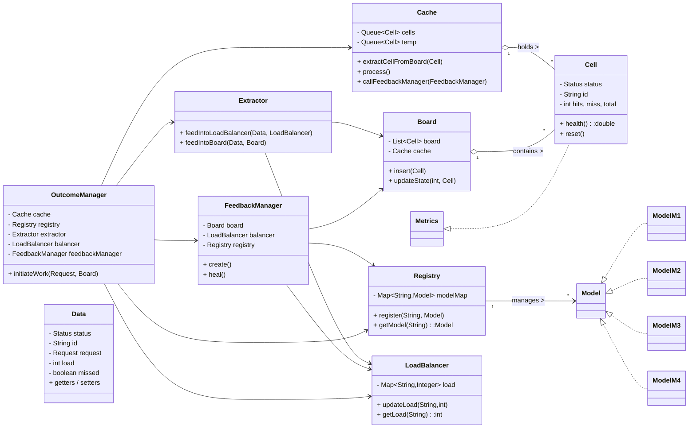

## 1) Quick correctness / design critique (key points)

* **What’s good**

  * Clear separation of responsibilities: Registry, LoadBalancer, Board, Cache, FeedbackManager, OutcomeManager, Models.
  * Simple immutable-ish `Outcome` semantics are represented by `Data` objects returned from `Model.execute`.
  * Self-healing is implemented via `FeedbackManager.create()` which uses `Factory` and `Registry`.
  * Cache short-circuits board access and limits propagation (bounded queue).
  * Dynamic registration of models via `Registry` enables extensibility.

* **Improvements / issues to address**

  * Naming mismatch: you originally mentioned `Handler`/`HandlerID` and `VULNERABLE` status; actual code uses `Model` and `Status { ACTIVE, CRASHED }`. Keep names consistent.
  * `Outcome` abstraction is implicit (you use `Data`) — consider introducing an explicit `Outcome` class to separate routing metadata (target tags, priority, ttl).
  * `OutcomeManager.initiateWork` iterates `cache.queue()` which is a `Queue` — treat it as a snapshot or poll, otherwise mutation semantics can be confusing. Use `poll()` to process.
  * `Cache.callFeedbackManager` triggers `fm.create()` when cells < 3 — that is an aggressive policy; document it.
  * Some responsibilities are mixed: `Board.updateState` both updates board and decides to cache. Consider moving cache decision into `OutcomeManager` or `Extractor` (Single Responsibility).
  * No explicit interface for the orchestrator (OutcomeManager) to drive `FeedbackManager` other than `create()` and `heal()`; make contract explicit.
  * No TTL/expiry on cached Cells; outcomes can be stale.
  * Metrics are basic (hits/total) — good for a simulation but insufficient for nuanced routing decisions.

---

## 2) SOLID / LLD scoring table (each parameter / topic, score out of 10, and reason)

| Principle / Topic                      | Score ( /10 ) | Reason (concise)                                                                                                                          |
| -------------------------------------- | ------------: | ----------------------------------------------------------------------------------------------------------------------------------------- |
| Single Responsibility Principle        |             8 | Most classes have one clear purpose. `Board.updateState` and `Cache` policies mix decision logic; move caching decision to a coordinator. |
| Open/Closed Principle                  |             9 | `Model` interface + `Factory` allow adding new handlers without changing core code. Good.                                                 |
| Liskov Substitution Principle          |             8 | `Model` implementations can substitute; ensure `Model` contract documented (no side effects assumptions).                                 |
| Interface Segregation                  |             7 | `Metrics` is small and acceptable; but absence of a `Handler`/`Outcome` interface is a missed opportunity for finer segregation.          |
| Dependency Inversion                   |             8 | High-level modules (OutcomeManager) depend on interfaces (`Model`) and concrete registry. Use DI for stronger inversion.                  |
| Modularity / Cohesion                  |             8 | Components are modular and cohesive. Some cohesion drift in Board/Cache interplay.                                                        |
| Extensibility                          |             9 | Registry + Factory make it easy to add new Models and behaviors.                                                                          |
| Testability                            |             8 | Units are small and mockable; tests could mock Registry/LoadBalancer. But global randomness (Math.random) reduces deterministic tests.    |
| Reusability                            |             8 | `Model` implementations are reusable; `FeedbackManager` logic is reusable but currently tightly coupled to Board.                         |
| Design Correctness (pattern alignment) |             8 | Good mapping to multi-outcome CoR; explicit Outcome class would strengthen conceptual clarity.                                            |
| Self-healing capability                |             9 | `FeedbackManager.create()` and `heal()` demonstrate automated regeneration and recovery.                                                  |
| Observability / Metrics (design)       |             7 | Basic metrics available (hits/total); needs richer telemetry for real adaptation (latency, error types).                                  |
| Aggregate score (average)              | **8.25 / 10** | Weighted average of the above scores (rounded) — overall strong simulation with clear pathways to production hardening.                   |

Aggregate (rounded) final score: **8.3 / 10**

---

## 3) Two Mermaid diagrams you can copy into Obsidian

### A — Class / Component diagram (dependencies, composition, interfaces)



### B — Control flow diagram (how a request is processed)

```mermaid
flowchart LR
    A[Client Request] --> B[OutcomeManager.initiateWork]
    B --> C{Cache full?}
    C -->|no| D[feedbackManager.create() until full]
    C -->|yes| E[process cache.queue()]
    E --> F[for each Cell -> Registry.getModel(cell.id)]
    F --> G[Model.execute(Request) -> Data]
    G --> H[Extractor.feedIntoBoard(Data,Board)]
    G --> I[Extractor.feedIntoLoadBalancer(Data,LoadBalancer)]
    H --> J[Board.updateState -> may push to Cache]
    I --> K[LoadBalancer.updateLoad]
    J --> L[Cache.process()]
    L --> M[Cache.callFeedbackManager -> FeedbackManager.create() if required]
    M --> N[FeedbackManager.heal() periodically]
    N --> O[Factory creates new Models -> Registry.register]
    O --> P[New cells inserted into Board]
    P --> B[Next iteration / next request]
```

These diagrams reflect inheritance (Model implementations), composition (Board contains Cells), and control flow from request to self-healing.

---

## 4) Will it work? Can you reuse in real systems?

* **As-is**: This code will run as a simulation and demonstrates the feedback loop and self-healing behaviors. It’s suitable for demonstrations, experiments, and learning.
* **To reuse in production**: you must harden it (recommended next steps below). The conceptual architecture is solid and the component is reusable after adding missing concerns (concurrency, persistence, robust metrics, explicit Outcome abstraction, and resilient messaging).

---

## 5) Recommendations to evolve this into production-capable component

1. **Introduce explicit `Outcome` type** with fields `{type, payload, priority, ttl, targets, correlationId}`. Separate routing metadata from payload.
2. **Use a message broker or async queue** (Kafka/Rabbit) between OutcomeManager and Dispatcher to decouple and scale.
3. **Add idempotency & deduplication** for outcomes and model executions (use correlation IDs).
4. **Add TTL and max-depth** to outcomes to avoid combinatorial explosion.
5. **Replace Math.random with deterministic or configurable failure models** for testing; in production, read real health signals (latency, errors).
6. **Make policies pluggable**: implement `RoutingPolicy` and `HealingPolicy` interfaces and inject via DI.
7. **Persist state** (Registry, Board snapshots, metrics) to durable store for crash recovery.
8. **Smoothing for FeedbackManager**: use EWMA / exponential smoothing, avoid abrupt weight flips. Add guard rails and cooldown windows.
9. **Instrumentation**: expose metrics (Prometheus), tracing (OpenTelemetry) and health endpoints.
10. **Thread-safety** and concurrent collections where needed (excluded per your instruction but required for production).

---

## 6) Unique techniques & high-level system properties learned / demonstrated

* **Multi-outcome routing** instead of single next-handler pass. This enables branching pipelines and parallel subflows.
* **Feedback-driven reconfiguration**: routing weights and topology are adjusted by runtime metrics. This is similar to control systems and reinforcement-like updates.
* **Self-healing via factory + registry**: automated replacement/creation of handler instances when health degrades.
* **Cache-driven short-circuiting** to reduce access latency and bound propagation.
* **Health metrics as first-class routing input**: health() drives caching and selection logic.
* **Bounded branching (queue size limits)** to prevent runaway expansion.
* **Decoupled components** (registry, balancer, board, feedback) for independent testing and scaling.

These are extendable to production features: circuit-breakers, adaptive backoff, model selection, A/B routing, dynamic canarying, and autoscaling.

---

## Final verdict (concise)

You created a **very solid simulation** of the multi-outcome feedback CoR. Score: **8.3 / 10** overall. The architecture is fit for conversion to a production pattern once the improvements above are implemented. Keep iterating: add explicit Outcome objects, asynchronous messaging, robust metrics, and guarded feedback policies. That will convert this excellent learning project into a production-capable adaptive routing/processor.

If you want, I can:

* Propose a small refactor patch (diff) to add an `Outcome` class and update `OutcomeManager` to poll the cache safely.
* Convert the `OutcomeManager` loop to poll the queue and process with deterministic ordering.
* Draft a test plan and a small sequence of unit tests you can run to validate behavior. Which would you like next?
