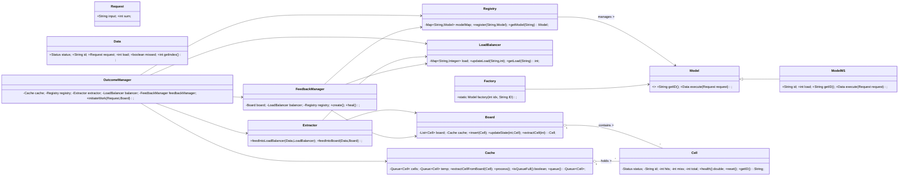
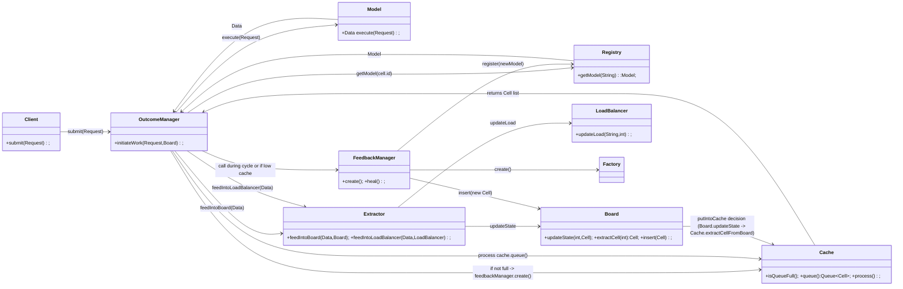
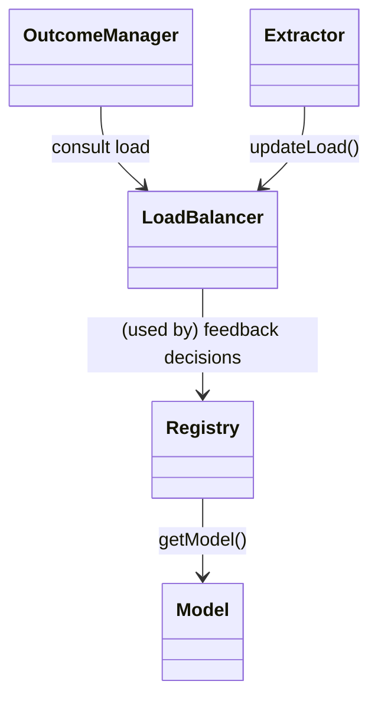
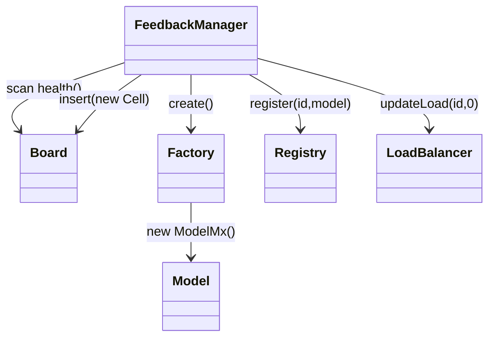
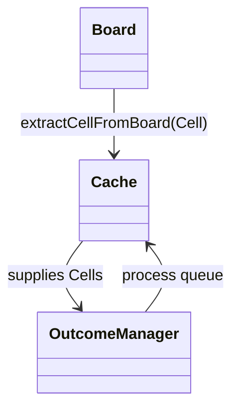
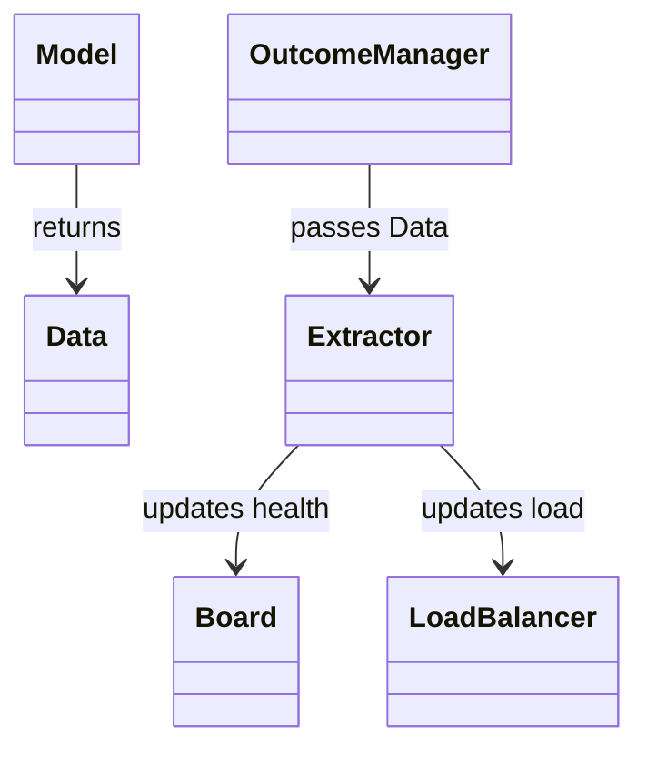

---

# Multi-Outcome Feedback-Driven Chain of Responsibility

**A self-healing, adaptive Chain of Responsibility simulation** implemented in Java.
Provides: dynamic handler selection, registry-based load balancing, cache short-circuiting, outcome-driven routing, and a feedback loop that performs automated healing and factory-driven regeneration.

---

## Table of contents

1. Purpose
2. High-level summary
3. Folder structure (files → one-liner)
4. Component glossary (detailed responsibilities)
5. Class diagrams (Mermaid `classDiagram`)
6. Control-flow (expressed via class diagrams and interactions)
7. Unique techniques explained (one section per technique with class diagram)
8. How to extend to production (concise steps)
9. Summary

---

## 1. Purpose

This component demonstrates a multi-outcome CoR variant where handlers (Models) emit outcomes as `Data` objects. The `OutcomeManager` orchestrates execution using a `Cache`, `Registry`, and `LoadBalancer`. The `FeedbackManager` observes aggregated metrics and performs automated healing / factory creation through `Factory` and `Registry`. The design is intended for learning, prototyping, and small-scale experiments; it is readily extensible into a production-grade subsystem.

---

## 2. High-level summary

* Client submits a `Request`.
* `OutcomeManager` uses `Cache` to pick candidate `Cell` entries.
* For each `Cell`, it resolves `Model` from `Registry` and calls `Model.execute(Request)` producing `Data` (the implicit Outcome).
* `Extractor` updates `Board` (health) and `LoadBalancer` (load). `Board` may push good cells into `Cache`.
* `FeedbackManager` monitors `Board` and `LoadBalancer` and can `create()` or `heal()` models via `Factory` and `Registry`.
* The loop continues iteratively to demonstrate self-healing and adaptive routing.

---

## 3. Folder structure (file → one-liner)

```
src/main/java/chainofresponsibility/extreme/multioutcomechain/
├── Board.java               // Board: persistent registry of Cells (handler health snapshots)
├── Cache.java               // Cache: short-lived queue of top Cells for fast selection
├── Cell.java                // Cell: metrics holder (hits/miss/total + health())
├── Data.java                // Data: outcome-like payload from Model.execute
├── Extractor.java           // Extractor: writes Data into Board + LoadBalancer
├── Factory.java             // Factory: creates concrete Model instances (ModelM1..M4)
├── FeedbackManager.java     // FeedbackManager: observes health & load, creates/heals models
├── LoadBalancer.java        // LoadBalancer: registry of realtime loads by handler id
├── Model.java               // Model interface: execute(Request) -> Data
├── ModelM1..ModelM4.java    // Concrete Models (simulated handlers)
├── OutcomeManager.java      // OutcomeManager: orchestrates cache->registry->execution loop
├── Registry.java            // Registry: map of id -> Model
├── Request.java             // Request: client payload to be processed
├── Metrics.java             // Metrics: interface for health counters (used by Cell)
├── Extractor.java           // Extractor: moves Data into Board/LoadBalancer
└── README.md                // This doc
```

---

## 4. Component glossary (detailed responsibilities)

* **Model (interface)**

  * Contract for all handler implementations. `Data execute(Request request)`.
  * Purpose: encapsulate processing logic and return `Data` (outcome + metadata).

* **ModelM1..ModelM4 (concrete)**

  * Emulate distinct handler behavior. Update internal `load`. Randomly set `missed` to simulate failure. Return `Data` with `status`, `load`, `missed`.

* **Registry**

  * Map of `id -> Model`.
  * Purpose: service locator for dynamic lookup of handler instances. Registry is the authoritative store used by `OutcomeManager` and `FeedbackManager`.

* **OutcomeManager**

  * Orchestrator for a single cycle. Uses `Cache` to pick `Cell`s and runs associated `Model.execute`. Calls `Extractor` to update `Board` and `LoadBalancer`. Invokes `FeedbackManager` when cache is not full or at policy triggers. Purpose: real-time routing and execution.

* **Cache**

  * Bounded queue of `Cell` references (size 3 in code). Holds the best candidate handlers for quick selection. Reduces load on `Board` for read-heavy paths.

* **Board**

  * Persistent list of `Cell` objects indexed by handler numeric suffix. Stores health snapshots, provides `updateState`, and decides when to place `Cell` into `Cache` (via `putIntoCache` policy).

* **Cell**

  * Implements `Metrics`. Tracks `hits`, `miss`, `total`, `health()` and `status`. Used as lightweight handler proxies for selection and health evaluation.

* **Extractor**

  * Single-purpose utility that accepts `Data` and updates `Board` (health) and `LoadBalancer` (load).

* **LoadBalancer**

  * Simple map-based load registry. Stores per-handler load values. OutcomeManager/Extractor update it; FeedbackManager consults it for healing decisions.

* **FeedbackManager**

  * Observes `Board` and `LoadBalancer` and performs two actions:

    * `create()` uses `Factory` to instantiate a new `Model`, register it, and insert a new `Cell` into `Board`.
    * `heal()` scans `Board` to reset health counters on poorly performing `Cell`s and updates `LoadBalancer`. Purpose: self-healing and regeneration.

* **Factory**

  * Creates concrete `Model` objects by index, used by `FeedbackManager` to add new handlers to the system.

* **Request / Data**

  * `Request`: client payload.
  * `Data`: returned by Model.execute and used by Extractor and OutcomeManager as the unit of an outcome (contains `id`, `load`, `missed`, `status`).

---

## 5. Class diagrams (Mermaid `classDiagram`)

> Note: these diagrams show classes, primary fields and core methods. They illustrate composition and associations used by design.

### Main system class diagram



---

## 6. Control flow (expressed as class interactions in class diagrams)

> The following `classDiagram` highlights the sequence of responsibilities by annotating method names to show the functional chain. This is a class-centric depiction of control flow.



---

## 7. Unique techniques explained (each with a small Mermaid class diagram and details)

### A. Registry-based Load Balancing

**Intent:** Use a central `Registry` and `LoadBalancer` to route by load without tightly coupling orchestration to specific model implementations.
**How it’s implemented:** `Extractor.feedIntoLoadBalancer(data, balancer)` writes load into `LoadBalancer`, `FeedbackManager` or a future routing policy can query `LoadBalancer.getLoad(id)` and `Registry.getModel(id)` to make decisions.

Mermaid snippet showing classes involved:



**Notes:** This is a lightweight, simulation-level load registry. In production replace with a metrics system and an adaptive router that uses weighted selection.

---

### B. Self-healing (FeedbackManager + Factory)

**Intent:** Detect degraded handler health and remediate automatically by resetting metrics or creating new handler instances.
**How it’s implemented:** `FeedbackManager.heal()` resets poorly performing `Cell` metrics; `create()` uses `Factory.factory(...)` to create a new `Model` and `Registry.register(id, model)` to make it available.

Mermaid snippet:



**Notes:** Healing includes metric reset and load initialization. Extend to add cooldowns, canary deployments, and validation probes.

---

### C. Cache short-circuiting (Board → Cache)

**Intent:** Reduce read/selection latency and bound propagation by keeping a small set of high-health `Cell`s in `Cache`.
**How it’s implemented:** `Board.updateState(index, cell)` evaluates `putIntoCache` and calls `cache.extractCellFromBoard(cell)` when criteria met.

Mermaid snippet:



**Notes:** Cache size is bounded; include TTLs and eviction policies for production.

---

### D. Outcome-as-Data (implicit Outcome)

**Intent:** Use `Data` returned by `Model.execute` as the outcome object carrying routing metadata (id, load, missed, status).
**How it’s implemented:** `OutcomeManager` treats `Data` as an outcome and `Extractor` interprets it for routing updates.

Mermaid snippet:



**Notes:** Consider introducing a dedicated `Outcome` type to separate routing metadata from payload.

---

## 8. How to extend to production (practical steps)

* Replace `Math.random()` failure simulation with real health signals (latency, error rate).
* Add explicit `Outcome` object: `{type, payload, priority, ttl, targets, correlationId}`.
* Use async messaging (Kafka/Redis/Rabbit) between `OutcomeManager` and dispatchers.
* Implement idempotency keys and deduplication.
* Persist `Registry` and `Board` to durable store for crash recovery.
* Replace in-memory `LoadBalancer` with a metrics backend (Prometheus + service discovery).
* Harden `FeedbackManager` with smoothing (EWMA) and cooldown windows to avoid oscillation.
* Add unit and integration tests with deterministic failure injection.

---

## 9. Summary (closing)

This README documents a compact, extensible simulation of a multi-outcome feedback-driven Chain of Responsibility. The component demonstrates several advanced system design techniques—registry-based load balancing, cache short-circuiting, factory-driven regeneration, and a feedback-managed self-heal loop. It is intentionally modular. You can evolve each piece into production by introducing asynchronous messaging, observability, idempotency, and robust policy modules.
