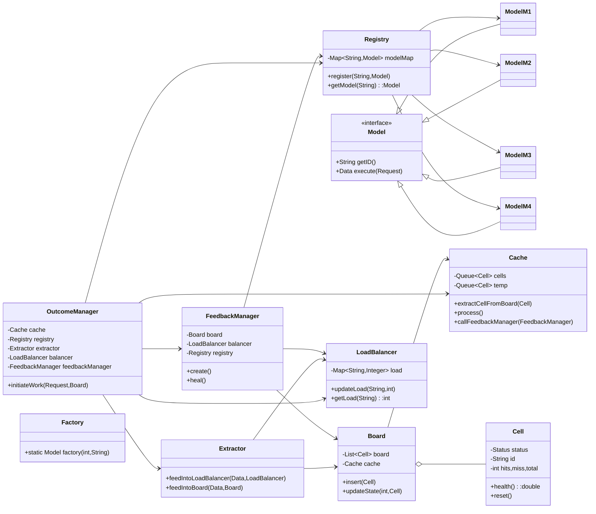
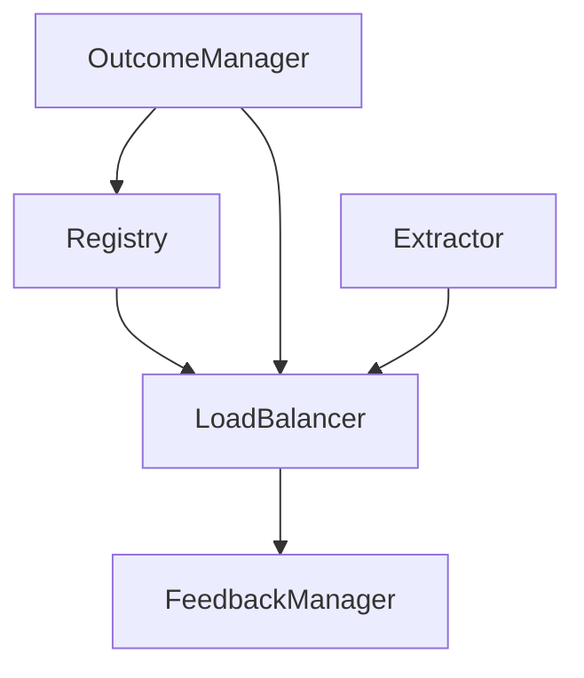
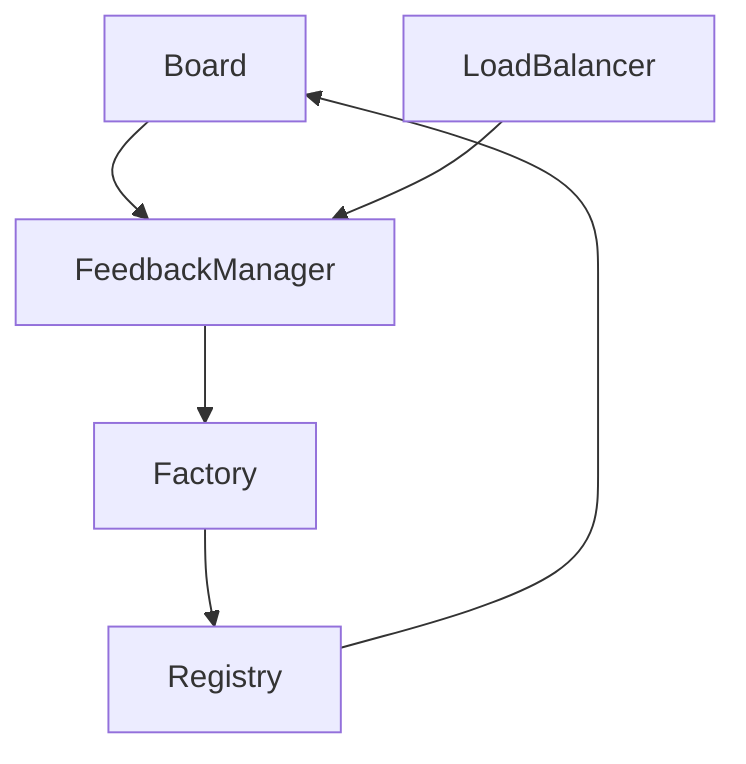
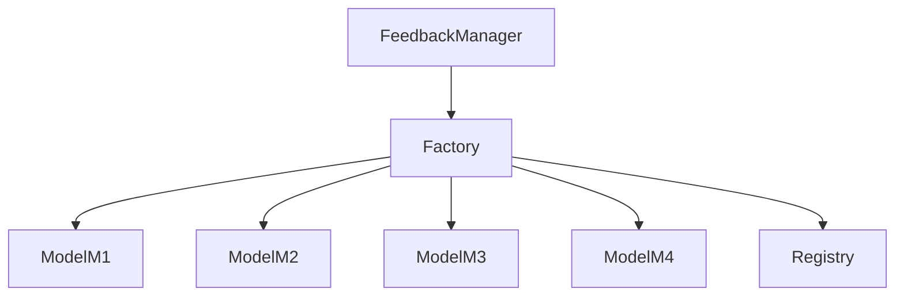

Direct answer: below is a documentation-ready README you can drop into your project root. It explains the design, folder structure, purpose of each class, control flow, class diagram, and the three unique techniques (registry-based load balancing, self-healing, dynamic factory assertion) with focused block diagrams and code-style class snippets. Copy this file into `README.md`.

---

# Self-Healing Multi-Outcome Chain of Responsibility

A compact, production-minded simulation of a Chain of Responsibility extended with multi-outcome routing, feedback-driven adaptation, and self-healing. Demonstrates how handlers (models) emit outcomes, how outcomes are routed and aggregated, and how a FeedbackManager repairs and re-registers handlers automatically.

---

## Contents

* Overview
* Architecture (high-level)
* Folder structure
* Component reference (each class / interface explained)
* Control flow (block diagram)
* Class diagram (Mermaid)
* Unique techniques (registry-based load balancing, self-healing, dynamic factory assertion) — each with focused block diagram and class-level explanation
* How to run / test (primitive)
* Extensibility & production hardening notes
* Summary

---

## Overview

This component simulates an adaptive execution pipeline:

* `Model` implementations (M1..M4) act as handlers that process `Request` and emit `Data` (an outcome record).
* `OutcomeManager` orchestrates work using a `Cache` (bounded queue) and `Registry` to find models.
* `Extractor` writes outcomes to `Board` (HealthRegister) and `LoadBalancer`.
* `FeedbackManager` analyzes system state and performs healing or creation using a `Factory`.
* `Registry` stores active `Model` instances. `LoadBalancer` tracks runtime load metrics.

Goal: show how an adaptive CoR pipeline can monitor, react, and heal itself without external orchestration.

---

## Architecture (high-level)

Layers:

1. Client layer — sends `Request`.
2. Orchestration layer — `OutcomeManager` (dispatch) + `Extractor`.
3. Observability & state — `Board` (health), `LoadBalancer`, `Cache`.
4. Adaptive control — `FeedbackManager`, `Factory`, `Registry`.
5. Execution nodes — `ModelM1..M4` (handler implementations).

Design constraints:

* Bounded propagation via `Cache` queue size.
* Feedback loop that can create and register new models.
* Simple health metrics (hits/total) used to make caching and healing decisions.

---

## Folder structure

```
/src
  /main
    /java
      /chainofresponsibility
        /extreme
          /multioutcomechain
            Board.java
            Cache.java
            Cell.java
            Data.java
            Extractor.java
            Factory.java
            FeedbackManager.java
            LoadBalancer.java
            Metrics.java
            Model.java
            ModelM1.java
            ModelM2.java
            ModelM3.java
            ModelM4.java
            OutcomeManager.java
            Registry.java
            Request.java
            Status.java
README.md
```

Brief role for each file:

* **Board.java** — Health register. Contains `Cell` list and policies for adding/updating cells and pushing to cache.
* **Cache.java** — Bounded in-memory queue for high-health `Cell` objects. Triggers `FeedbackManager` when thresholds are below limits. Provides queue snapshot for processing.
* **Cell.java** — Health metric holder. Implements `Metrics`. Maintains hit/miss/total counters. `health()` returns hit/total.
* **Data.java** — Outcome (routing packet). Carries id, load, request, missed flag, and status.
* **Extractor.java** — Glue that writes `Data` into `Board` and updates `LoadBalancer`. Encapsulates state-change logic.
* **Factory.java** — Creates `Model` instances. Encapsulates creation logic.
* **FeedbackManager.java** — Observes board/load, creates new models, and heals weak cells by resetting metrics and updating balancer.
* **LoadBalancer.java** — Simple in-memory map of model id → integer load. Read/write used by `OutcomeManager` and `Extractor`.
* **Metrics.java** — Interface for hit/miss/health; implemented by `Cell`.
* **Model.java** — Handler abstraction: `execute(Request): Data`. Implemented by ModelM1..M4.
* **ModelM*.java** — Concrete handlers. Simulated randomness used for hits/misses and load. Return `Data`.
* **OutcomeManager.java** — Main orchestrator. Ensures cache is filled, iterates cells, calls models, feeds results to `Extractor`, updates load, processes cache.
* **Registry.java** — Central registry mapping id → Model instance. Supports `register` and `getModel`.
* **Request.java** — Simple request payload.
* **Status.java** — Enum for `ACTIVE`, `CRASHED`.

---

## Component reference (detailed)

### `Model` (interface)

```java
public interface Model {
    String getID();
    Data execute(Request request);
}
```

Purpose: polymorphic handler. Implementations simulate processing and return `Data` representing an outcome.

### `ModelM1/2/3/4`

Key behavior: maintain internal `load` counter, simulate success/failure via randomness, produce `Data` with `id`, `load`, `missed` flag and `Status`.

### `Registry`

```java
public class Registry {
    private final Map<String, Model> modelMap = new LinkedHashMap<>();
    public void register(String id, Model m) { modelMap.put(id, m); }
    public Model getModel(String id) { return modelMap.get(id); }
}
```

Purpose: central addressability for models. Enables OutcomeManager and Extractor to find models by id.

### `OutcomeManager`

```java
public class OutcomeManager {
    private final Cache cache;
    private final Registry registry;
    private final Extractor extractor;
    private final LoadBalancer balancer;
    private final FeedbackManager feedbackManager;
    public void initiateWork(Request request, Board board) { ... }
}
```

Purpose: drives work. Ensures cache has cells (triggers FeedbackManager.create when needed), iterates cells, retrieves model by cell id, calls `model.execute`, updates cell hits/misses, feeds Extractor, updates LoadBalancer, and processes cache.

Design note: treat `cache.queue()` as snapshot or poll items to avoid iterator-while-modify issues.

### `Extractor`

```java
public class Extractor {
    public void feedIntoLoadBalancer(Data data, LoadBalancer balancer) { ... }
    public void feedIntoBoard(Data data, Board board) { ... }
}
```

Purpose: centralizes side-effect updates to board and balancer. Keeps OutcomeManager simpler.

### `Board` and `Cell`

* `Board` holds list of `Cell`. `Board.updateState(index, cell)` updates the board and, if cell meets health criteria, pushes cell to `Cache`.
* `Cell` implements `Metrics` with counters and `health()`.

### `Cache`

* Bounded queue of `Cell` objects (size 3 in sample). `extractCellFromBoard` is called by Board when adding healthy cells. `process()` cleans out cells with low health and maintains queue.

### `FeedbackManager`

* `create()` uses `Factory` to create new Models and registers them into `Registry`. Inserts new `Cell` into `Board`, and calls `balancer.updateLoad(id, 0)`.
* `heal()` iterates board and resets the metrics of low-health cells. Also updates LoadBalancer to zero load.

### `LoadBalancer`

* Simple map of model id → current load. Used for influence and observability. Not a heavy scheduling algorithm in the sample; extendable.

---

## Control flow — block diagram

Paste the following Mermaid block diagram into Obsidian (it is a block-style conceptual diagram, not a flowchart):

```mermaid
graph TB
  Client[Client Request] --> OM(OutcomeManager)
  OM -->|ensure cache full| FM(FeedbackManager)
  FM -->|create/register| Registry
  FM -->|insert cell| Board
  Board --> Cache
  Cache --> OM
  OM -->|for each cell| Registry
  Registry --> Model[Model Instance (M1..M4)]
  Model --> Data[Data (outcome)]
  Data --> Extractor
  Extractor --> Board
  Extractor --> LoadBalancer
  Board --> Cache
  LoadBalancer --> FM
  Board --> FM
  FM -->|heal/create| Factory
  Factory --> Registry
```

Explanation in words:

1. Client calls `OutcomeManager`.
2. `OutcomeManager` fills `Cache` by invoking `FeedbackManager` when the cache is not full.
3. `FeedbackManager.create()` uses `Factory` to produce models and registers them via `Registry`. It also inserts board `Cell`s for these models.
4. `OutcomeManager` processes each `Cell` in `Cache`, retrieves corresponding `Model` from `Registry`, and calls `execute`.
5. `Model` returns `Data` (outcome). `Extractor` writes `Data` into `Board` and updates `LoadBalancer`.
6. `Board` uses `Cell.health()` to decide whether to keep a `Cell` in `Cache`.
7. `FeedbackManager` consumes load and board data to decide on heals / creates.

---

## Class diagram (Mermaid)

Place this Mermaid class diagram in your README or Obsidian:



---

## Unique techniques & focused block diagrams

Each technique below explains which classes participate and how.

### 1) Registry-based Load Balancing (lightweight)

**Purpose:** Central registry provides addressability and baseline for load updates; `LoadBalancer` holds runtime load metrics to drive decisions.

Block diagram:



How it works:

* `Registry` stores `Model` instances and IDs.
* `OutcomeManager` asks `Registry` for model by ID and triggers `Model.execute`.
* `Extractor` on each `Data` writes `load` into `LoadBalancer.updateLoad`.
* `FeedbackManager` queries `LoadBalancer` metrics to decide healing or creating new instances.
* Extension: swap `LoadBalancer` with a weighted scheduler to select faster models based on `getLoad`.

Code snippet (LoadBalancer):

```java
public class LoadBalancer {
    private final Map<String,Integer> load = new LinkedHashMap<>();
    public void updateLoad(String server, int loadValue) { load.put(server, loadValue); }
    public int getLoad(String server) { return load.getOrDefault(server, 0); }
}
```

### 2) Self-Healing (Feedback -> Factory -> Registry -> Board)

**Purpose:** When HealthRegister shows degraded cells, FeedbackManager heals or creates new model instances.

Block diagram:



How it works:

* `Board` exposes health metrics via `Cell.health()`.
* If low health detected, `FeedbackManager.heal()` resets metrics and updates balancer to zero.
* If insufficient capacity, `FeedbackManager.create()` uses `Factory.factory()` to instantiate new `Model`.
* `Registry.register()` stores the new model and `Board.insert()` adds corresponding `Cell`.
* This forms the self-healing create-and-register loop.

Code snippet (FeedbackManager.create):

```java
public void create() {
    int r = (int)(Math.random() * 4) + 1;
    String id = "M"+board.size();
    Model model = Factory.factory(r, id);
    registry.register(id, model);
    balancer.updateLoad(id, 0);
    Cell cell = new Cell(id);
    board.insert(cell);
}
```

### 3) Dynamic Factory Assertion

**Purpose:** `Factory` encapsulates how to create different `Model` implementations. It allows consistent, centralized instantiation policy.

Block diagram:



How it works:

* `Factory` receives a selection parameter and produces a `Model` instance.
* `FeedbackManager` decides when to call `Factory`.
* New models are registered to `Registry` and included in the system.

Factory code snippet:

```java
public class Factory {
    public static Model factory(int idx, String ID) {
        return switch (idx) {
            case 1 -> new ModelM1(ID);
            case 2 -> new ModelM2(ID);
            case 3 -> new ModelM3(ID);
            case 4 -> new ModelM4(ID);
            default -> throw new IllegalArgumentException("Invalid model index: " + idx);
        };
    }
}
```

---

## How to run (minimal / demo)

1. Build a small `Main` class that:

   * Instantiates `Registry`, `LoadBalancer`, `Board`, `Cache`, `Extractor`, `FeedbackManager`, and `OutcomeManager`.
   * Uses `Factory` to create a few initial models and `Registry.register` them.
   * Calls `OutcomeManager.initiateWork(request, board)` repeatedly (e.g., 25-30 epochs) to observe healing and creation.

Example pseudo-main:

```java
public static void main(String[] args) {
  Registry registry = new Registry();
  LoadBalancer balancer = new LoadBalancer();
  Cache cache = new Cache();
  Board board = new Board(cache);
  Extractor extractor = new Extractor();
  FeedbackManager fm = new FeedbackManager(board, balancer, registry);
  OutcomeManager om = new OutcomeManager(cache, registry, extractor, balancer, fm);

  // Seed models
  Model m1 = Factory.factory(1, "M0"); registry.register("M0", m1); balancer.initiateLoad("M0");
  Model m2 = Factory.factory(2, "M1"); registry.register("M1", m2); balancer.initiateLoad("M1");
  Model m3 = Factory.factory(3, "M2"); registry.register("M2", m3); balancer.initiateLoad("M2");

  Request req = new Request();
  req.setInput("input");
  for (int i=0;i<30;i++) {
    om.initiateWork(req, board);
  }
}
```

---

## Extensibility & production hardening notes

To move this from simulation to production:

* Introduce explicit `Outcome` object (metadata: `type, priority, ttl, targets, correlationId`).
* Replace in-memory queues and registry with distributed components (Kafka, Redis, service registry).
* Add durable persistence for Board/Registry state (DB) and metrics (Prometheus).
* Add idempotency & deduplication for outcomes (use correlation IDs).
* Implement exponential smoothing and cooldown windows in `FeedbackManager` to prevent oscillation.
* Introduce circuit breakers and timeouts for model execution.
* Externalize factory policies to configuration and support canary creation strategies.
* Add tracing (OpenTelemetry) for end-to-end observability.

---

## What you learn from this component (unique techniques & properties)

* **Multi-outcome routing**: handlers emit outcome records that can spawn parallel or branch execution.
* **Registry-based discovery**: enables dynamic addition/removal and addressability of handlers.
* **Cache short-circuiting**: reduces access to lower-quality nodes and bounds work queue size.
* **Self-healing**: detection (via Board health metrics) and automated creation/healing of handlers via Factory.
* **Feedback-driven adaptation**: load+health metrics drive decisions that change the next invocation topology.
* **Factory assertion & policy encapsulation**: centralizes object creation and enables runtime strategy change.

These techniques are production-relevant: autoscaling, canarying, circuit breaking, A/B runner selection, and self-repair.

---

## Summary

This README documents a compact, illustrative implementation of an adaptive Chain of Responsibility with multi-outcome routing and a self-healing feedback loop. The code exercise is valuable as an educational prototype or internal demo. To make it production-grade, add durable state, distributed queues, richer outcomes, idempotency, and smoothing in the feedback engine. The design is modular, aligns with SOLID principles in practice, and demonstrates advanced system concepts that can be expanded for high-availability microservice platforms.

If you want, I will:

* Provide a patched refactor that introduces an explicit `Outcome` class and moves caching decision logic to `OutcomeManager`.
* Produce a `Main.java` driver you can run as-is.
* Generate unit tests for deterministic behavior by replacing randomness with injected strategy.

Which next step do you want?
