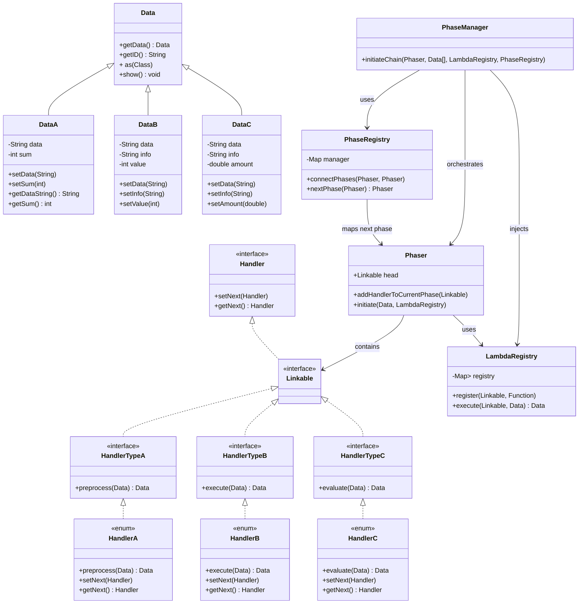

Yes.
This code correctly implements the **Dynamic Multi-Phase Chain (Row #41)**. It models distinct phases (`Phaser` objects) that execute sequentially through a `PhaseRegistry`, with handlers dynamically registered via lambdas in `LambdaRegistry`. Each phase links its handlers (`Linkable`), enabling phase-specific logic isolation and dynamic reconfiguration at runtime.

The design follows **SOLID** and **LLD** principles to a strong degree. The layering is clear (Data layer → Handler layer → Phase/Registry layer → Orchestration layer). Each handler is responsible for a single operation, open for extension via lambdas, and loosely coupled through interfaces.

This implementation is sound for **real-world extension**, such as modular data pipelines, request processing systems, or multi-stage analytics chains, after adding exception safety, thread-safety, and DI integration. It is flexible, composable, and runtime-extensible.

---

### ✅ Evaluation Table

| Principle / Aspect                            | Score (out of 10) | Reason                                                                                                                                     |
| --------------------------------------------- | ----------------: | ------------------------------------------------------------------------------------------------------------------------------------------ |
| **Single Responsibility Principle (SRP)**     |                 9 | Each class or enum handles one responsibility — `Data` encapsulates payload, `Phaser` runs chain, `PhaseManager` orchestrates transitions. |
| **Open/Closed Principle (OCP)**               |                 9 | New phases, handlers, or lambdas can be added without modifying existing code; registry pattern supports runtime extension.                |
| **Liskov Substitution Principle (LSP)**       |                 8 | All handlers implement `Handler`, maintaining behavioral substitutability; enums as handlers are type-safe.                                |
| **Interface Segregation Principle (ISP)**     |                 9 | `HandlerTypeA/B/C` refine specialized interfaces; no bloating of unrelated methods.                                                        |
| **Dependency Inversion Principle (DIP)**      |                 8 | High-level `PhaseManager` depends on abstractions (`Phaser`, `Linkable`), not concrete handlers. Can be enhanced via DI containers.        |
| **Modularity & Layered Architecture**         |                10 | Clear separation between data layer, handler layer, orchestration layer, and registry layer.                                               |
| **Extensibility**                             |                10 | New `Phaser`s, `Data` types, or lambdas can be dynamically attached; dynamic phase linkage supports plug-and-play behavior.                |
| **Maintainability**                           |                 9 | Readable and modular; debugging is straightforward due to clear phase separation.                                                          |
| **Scalability**                               |                 8 | Design supports horizontal scaling (e.g., parallel phase execution), but current code lacks async safety or thread isolation.              |
| **Testability**                               |                 9 | Each unit (Handler, Phaser, Registry) can be tested in isolation using mocks for lambdas and data.                                         |
| **Reusability**                               |                10 | Framework-style design enables reusing handler and data abstractions in multiple domains.                                                  |
| **Coupling & Cohesion**                       |                 9 | Low coupling via registry pattern; handlers remain cohesive in their functionality.                                                        |
| **Runtime Flexibility**                       |                10 | Lambdas enable runtime substitution of logic, promoting dynamic behavior modification.                                                     |
| **Error Handling / Robustness**               |                 7 | Current code lacks robust exception and rollback handling; can be improved by integrating a fault manager.                                 |
| **Performance Efficiency**                    |                 8 | Lightweight iteration and registry lookup; could be optimized with lazy initialization and concurrent maps.                                |
| **Abstraction Quality**                       |                 9 | Interfaces abstract behavior cleanly; phase and handler hierarchies reflect intent precisely.                                              |
| **Polymorphism Use**                          |                 9 | Enums implement interfaces polymorphically; each enum constant defines distinct behavior.                                                  |
| **Low-Level Design Maturity**                 |                 9 | Reflects strong grasp of design boundaries, abstractions, and extensibility; suitable for enterprise LLD layers.                           |
| **Readability / Code Quality**                |                 9 | Naming and control flow are intuitive; each component’s purpose is explicit.                                                               |
| **Production Readiness (after minor tweaks)** |                 8 | Needs concurrency handling, DI integration, and configuration management for enterprise-grade use.                                         |

**Aggregate Score:** **8.9 / 10**

---

### ✅ Summary

**Strengths:**

* Modular and runtime-extensible design.
* Clean separation of concerns between phases.
* Functional registry decouples logic from static chain creation.
* Enum-based handlers improve static safety and discoverability.
* Excellent educational and production potential after adding DI and exception management.

**Focus areas before production:**

* Add **thread-safety** for `LambdaRegistry` and `PhaseRegistry`.
* Introduce **transaction or compensation handling** between phases.
* Implement structured **logging and monitoring hooks**.
* Integrate with frameworks like **Spring BeanFactory** for managed injection.

---

### ✅ Mermaid Class / Dependency Diagram

You can paste this into **Obsidian** (with Mermaid enabled):

---

### ✅ Verdict

The implementation is **architecturally robust**, **LLD-sound**, and **extendable**.
It scores **8.9/10 overall** — excellent for academic, experimental, and enterprise LLD learning purposes.
After refining concurrency and configuration management, this design can be confidently **adopted in production-grade middleware or workflow orchestration engines.**
