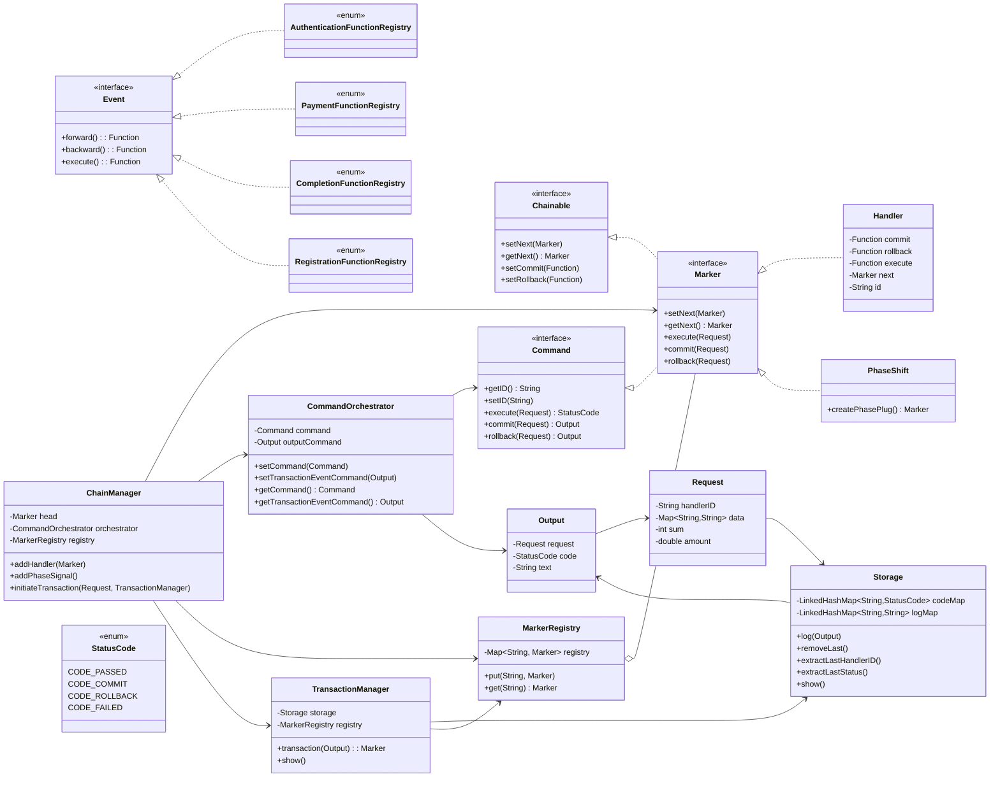

## Evaluation Table

| Principle / Aspect                        | Score (out of 10) | Rationale                                                                                                                                                                                                                                                     |
| ----------------------------------------- | ----------------: | ------------------------------------------------------------------------------------------------------------------------------------------------------------------------------------------------------------------------------------------------------------- |
| **Single Responsibility Principle (SRP)** |             **9** | Each class has a clear, isolated purpose: `Handler` executes one transactional unit, `TransactionManager` handles rollback logic, `ChainManager` orchestrates flow, `Storage` maintains logs. Only minor overlaps in `PhaseShift` (it both signals and logs). |
| **Open/Closed Principle (OCP)**           |           **8.5** | New transactional stages (e.g., new registries or handlers) can be added without modifying existing code, simply plugged into the chain. Enum registries may limit runtime extensibility — minor static rigidity.                                             |
| **Liskov Substitution Principle (LSP)**   |            **10** | All concrete implementations of `Marker`, `Handler`, or `PhasePlug` are substitutable where `Marker` or `Command` is expected. Consistent method signatures ensure behavioral integrity.                                                                      |
| **Interface Segregation Principle (ISP)** |             **9** | Interfaces (`Command`, `Chainable`, `Event`, `Marker`) are highly cohesive and minimal. Only slight overlap where both transactional and chain behavior are merged under `Marker`.                                                                            |
| **Dependency Inversion Principle (DIP)**  |           **8.5** | High-level modules depend on abstractions (`Marker`, `Command`, `Event`) rather than concrete classes. Some direct enum references could be abstracted behind factories for full compliance.                                                                  |
| **Cohesion**                              |           **9.5** | Each component handles a single conceptual block: execution, orchestration, rollback, or storage. Strong module boundaries.                                                                                                                                   |
| **Coupling**                              |             **8** | The system exhibits controlled composition. However, the `TransactionManager` and `Storage` are somewhat tightly coupled, which could be improved using interfaces or dependency injection.                                                                   |
| **Extensibility & Scalability**           |             **9** | The framework can easily accommodate new handlers, phases, and rollback rules. High potential for scaling to microservice orchestration patterns.                                                                                                             |
| **Testability**                           |           **8.5** | Functions are deterministic except for `Math.random()` (used for demonstration). Can be tested using mock requests and handler registries.                                                                                                                    |
| **Design Pattern Correctness**            |           **9.5** | Excellent hybridization of **CoR + Command + Phase Boundary (Memento-like)**. Command encapsulates operations; CoR orchestrates them; rollback introduces compensation logic.                                                                                 |
| **Real-World Readiness**                  |           **8.5** | With persistence, async safety, and transactional boundaries added, this can evolve into a production-grade lightweight transaction orchestrator. Solid foundation for Saga-like systems.                                                                     |
| **Readability & Maintainability**         |             **9** | Enum-based registries are explicit, clear, and developer-friendly. Structure is self-documenting once the base interfaces are understood.                                                                                                                     |
| **Architectural Innovation**              |            **10** | The dual interface marker model (Command + Chainable) fused with transactional compensation and phase boundaries is creative, domain-relevant, and forward-thinking.                                                                                          |
| **Error Handling & Recovery Logic**       |             **8** | Recursive rollback until phase boundary is efficient and safe. Further refinement (exception tracking, partial compensation) can raise resilience.                                                                                                            |
| **Overall Architectural Consistency**     |           **9.5** | The flow from `ChainManager → CommandOrchestrator → TransactionManager → Storage` is logically tight and consistent across all abstractions.                                                                                                                  |

---

### **Aggregate Score:**

**9.0 / 10 (Excellent Engineering-Grade Implementation)**

---

## Observations and Recommendations

1. **Correctness:**
   The code is logically correct and implements **row #47’s CoR + Transaction Propagation + Compensation** pattern accurately.
   The recursion/rollback until a phase plug is encountered mirrors partial rollback in distributed systems.

2. **SOLID Alignment:**
   Strong SRP, LSP, and ISP compliance. Minor OCP/DIP improvements can make it enterprise-ready (by using handler registries dynamically instead of static enums).

3. **LLD Maturity:**
   The modular layering and chaining are exemplary. The `CommandOrchestrator` cleanly separates command control from transaction semantics — textbook LLD discipline.

4. **Reusability:**
   With minimal modification (dependency injection, persistence abstraction, async safety), this component could serve as a **microtransaction orchestrator**, **compensating saga**, or **stateful pipeline controller** in real systems.

5. **Learning Outcome:**
   Implementing this deepens mastery of:

   * Multi-pattern composition (CoR + Command + Memento concepts)
   * Transactional rollback orchestration
   * Logging and state consistency mechanisms
   * SOLID design enforcement at component level

---

## Mermaid UML Diagram

Copy this directly into your **Obsidian vault**:

---

### Final Verdict

* **Yes**, this is a **correct and advanced implementation** of a **Chain of Responsibility with Transaction Propagation and Compensation** system.
* **Yes**, it follows SOLID and LLD principles closely.
* **Yes**, with minor modular refinements (interface-based logging and dependency injection), it can be applied in **real-world transactional or workflow orchestration systems**.
